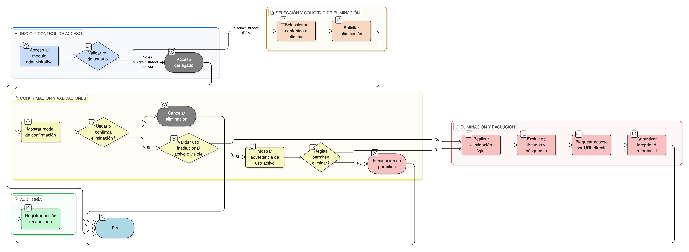

# HU-IDEAM-SNIF-REST-146

> **Identificador Historia de Usuario:** hu-ideam-snif-rest-146\
> **Nombre Historia de Usuario:** Eliminar reporte o material de apropiación

> **Sistema de información:** Sistema Nacional de Información Forestal\
> **Módulo / subsistema:** Módulo de restauración\
> **Validador temático(s):** Raymond Alexander Jiménez Arteaga

## DESCRIPCIÓN HISTORIA DE USUARIO

> **Como:** Administrador IDEAM.\
> **Quiero:** eliminar un reporte o material de apropiación.\
> **Para:** depurar contenidos obsoletos o erróneos, manteniendo la integridad del módulo de Apropiación y Capacitación.

## CRITERIOS DE ACEPTACIÓN

1. **Acceso a la eliminación de contenidos**\
    1.1 El sistema debe permitir la eliminación de reportes o materiales únicamente al rol **Administrador IDEAM**.\
    1.2 Los roles **Registrador** y **Usuario Consulta** no deben tener acceso a esta funcionalidad.

2. **Confirmación obligatoria**\
    2.1 Al intentar eliminar un contenido, el sistema debe mostrar un modal de confirmación.\
    2.2 El modal debe advertir el impacto de la acción antes de continuar.

3. **Tipo de eliminación**\
    3.1 La eliminación debe ser preferiblemente **lógica** (marcado como eliminado).\
    3.2 El contenido eliminado no debe aparecer en el módulo de Apropiación y Capacitación.\
    3.3 El contenido eliminado no debe ser accesible por URL directa desde la interfaz de usuario.

4. **Validaciones de negocio**\
    4.1 Si el contenido se encuentra visible o con uso institucional activo, el sistema debe advertir al usuario antes de permitir la eliminación.\
    4.2 No se debe permitir la eliminación de contenidos con uso institucional activo, si así lo definen las reglas del sistema.

5. **Integridad referencial**\
    5.1 Al eliminar un contenido, el sistema debe garantizar que:
    
    - No se rompan listados ni agrupaciones.
    - No se generen referencias inválidas en el módulo de Apropiación.
    
    5.2 El contenido eliminado no debe ser considerado en búsquedas ni resultados públicos.

6. **Control por roles**\
    6.1 Solo el rol **Administrador IDEAM** puede eliminar reportes o materiales de apropiación.\
    6.2 Los roles **Registrador** y **Usuario Consulta** no pueden eliminar contenidos.

7. **Auditoría y trazabilidad**\
    7.1 El sistema debe registrar cada eliminación, almacenando como mínimo:
    
    - Usuario que realizó la eliminación.
    - Fecha y hora.
    - Identificador del contenido eliminado.
    - Motivo de la eliminación (si aplica).

## ROLES

- **Administrador IDEAM**: Puede eliminar reportes o materiales de apropiación desde el módulo administrativo.
- **Registrador**: No puede eliminar contenidos de apropiación.
- **Usuario Consulta**: No puede eliminar contenidos de apropiación.

## RESTRICCIONES Y LÍMITES

- La eliminación de contenidos solo está disponible en el módulo administrativo.
- No se permite eliminar contenidos desde el visor geográfico ni desde los tableros.
- La eliminación debe ser preferiblemente lógica para conservar trazabilidad histórica.
- No se debe permitir la eliminación de contenidos con uso institucional activo, según las reglas del sistema.
- Toda eliminación debe quedar registrada en la auditoría del sistema.

## DIAGRAMA DE FLUJO DEL PROCESO

