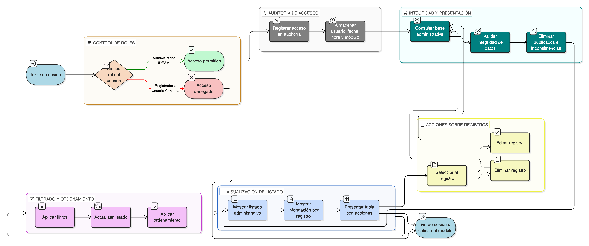

# HU-IDEAM-SNIF-REST-147

> **Identificador Historia de Usuario:** hu-ideam-snif-rest-147\
> **Nombre Historia de Usuario:** Visualizar listado administrativo de reportes

> **Sistema de información:** Sistema Nacional de Información Forestal\
> **Módulo / subsistema:** Módulo de restauración\
> **Validador temático(s):** Raymond Alexander Jiménez Arteaga

## DESCRIPCIÓN HISTORIA DE USUARIO

> **Como:** Administrador IDEAM.\
> **Quiero:** ver el listado completo de reportes o materiales de apropiación.\
> **Para:** gestionar y mantener el contenido del sistema de forma centralizada y controlada.

## CRITERIOS DE ACEPTACIÓN

1. **Acceso al listado administrativo**\
    1.1 El sistema debe permitir el acceso al listado de reportes o materiales únicamente al rol **Administrador IDEAM**.\
    1.2 Los roles **Registrador** y **Usuario Consulta** no deben tener acceso a este listado.

2. **Contenido del listado**\
    2.1 El listado debe mostrar, como mínimo, la siguiente información por cada registro:
    
    - Nombre.
    - Tipo de contenido.
    - Agrupación.
    - Estado de visibilidad (sí/no).
    - Fecha de creación y/o última actualización.

3. **Ordenamiento y filtrado**\
    3.1 El sistema debe permitir ordenar y filtrar el listado por:
    
    - Agrupación.
    - Tipo de contenido.
    - Estado de visibilidad.
    
    3.2 Los filtros y ordenamientos deben aplicarse de forma funcional e inmediata.

4. **Acciones por registro**\
    4.1 Cada fila del listado debe contar con acciones disponibles para:
    
    - Editar.
    - Eliminar.
    
    4.2 Las acciones deben estar disponibles únicamente para el rol **Administrador IDEAM**.

5. **Integridad de la información**\
    5.1 El listado debe reflejar exactamente los datos almacenados en la base administrativa.\
    5.2 No se deben mostrar registros duplicados ni inconsistentes.

6. **Experiencia de usuario (UX)**\
    6.1 El listado debe presentarse en una tabla con acciones por fila.\
    6.2 El sistema debe ofrecer filtros rápidos por agrupación y tipo de contenido.

7. **Auditoría de acceso**\
    7.1 El sistema debe registrar los accesos al módulo administrativo de reportes, almacenando como mínimo:
    
    - Usuario.
    - Fecha y hora.
    - Módulo consultado.

## ROLES

- **Administrador IDEAM**: Puede visualizar y administrar el listado completo de reportes o materiales de apropiación.
- **Registrador**: No puede acceder al listado administrativo.
- **Usuario Consulta**: No puede acceder al listado administrativo.

## RESTRICCIONES Y LÍMITES

- El listado administrativo solo está disponible en el módulo administrativo del sistema.
- No se permite el acceso al listado desde el visor geográfico ni desde los tableros.
- Solo el rol **Administrador IDEAM** puede ver y gestionar este listado.
- El listado debe reflejar en todo momento la información oficial almacenada en el sistema.
- Todo acceso al listado debe quedar registrado en la auditoría del sistema.

## DIAGRAMA DE FLUJO DEL PROCESO

