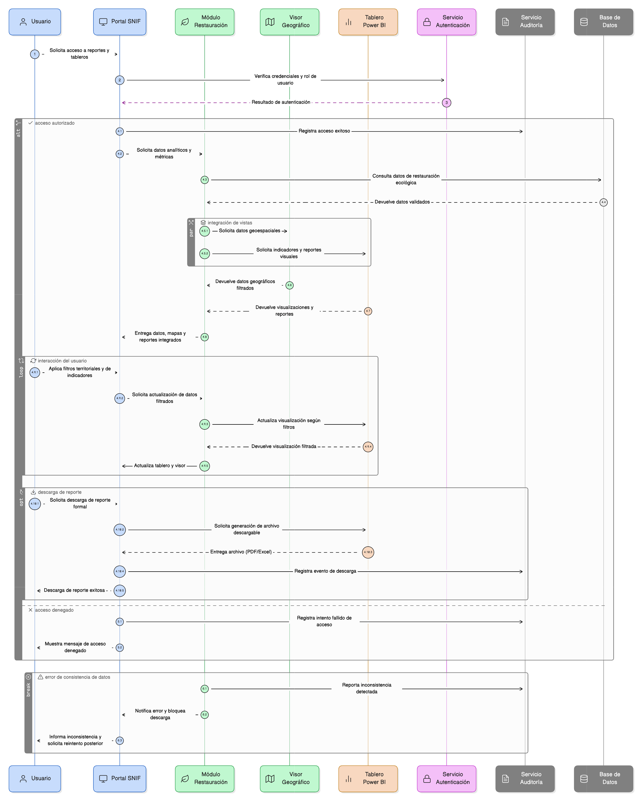

# Épica 14: Reportes y Tableros de Control

## 1. Descripción general

Esta épica define la implementación de reportes y tableros de control para el módulo de restauración del SNIF, permitiendo a los usuarios acceder a información analítica con una presentación visual clara, moderna y organizada, para monitorear indicadores, evaluar avances territoriales, generar reportes formales y apoyar la toma de decisiones.

Esta épica articula:

- Datos de restauración ecológica.
- Visor geográfico.
- Indicadores y métricas.
- Reportes descargables.
- Gobierno de acceso y auditoría.

El sistema garantiza control por roles, trazabilidad de accesos y consistencia entre datos, mapas y formularios.

## 2. Objetivo

Disponer de un conjunto de tableros de control y mecanismos de reporte que permitan:

- Monitorear el estado de las acciones de restauración y sus indicadores clave.
- Visualizar métricas y resultados de forma clara y comprensible.
- Facilitar la descarga de información analítica desde tableros Power BI.
- Integrar la consulta de información analítica con el visor geográfico.
- Garantizar el control de acceso a reportes y tableros según el rol del usuario.
- Asegurar la coherencia entre los datos publicados, los mapas y los formularios del sistema.

Con ello, el sistema fortalece la toma de decisiones, la transparencia de la información y el uso institucional de los datos del SNIF.

## 3. Historias de usuario asociadas

- [**HU-IDEAM-SNIF-REST-148:** Tablero de control general](EP-IDEAM-SNIF-REST-014/HU-IDEAM-SNIF-REST-148.md)
- [**HU-IDEAM-SNIF-REST-149:** Descarga de información desde tableros Power BI](EP-IDEAM-SNIF-REST-014/HU-IDEAM-SNIF-REST-149.md)
- [**HU-IDEAM-SNIF-REST-150:** Consulta y descarga de información desde tableros Power BI](EP-IDEAM-SNIF-REST-014/HU-IDEAM-SNIF-REST-150.md)
- [**HU-IDEAM-SNIF-REST-151:** Control de acceso a reportes](EP-IDEAM-SNIF-REST-014/HU-IDEAM-SNIF-REST-151.md)

## 4. Riesgos

- Inconsistencias entre los datos mostrados en tableros, el visor geográfico y los formularios del sistema.
- Publicación de indicadores calculados con información no validada o no oficial.
- Exposición de información sensible por una configuración incorrecta de permisos.
- Dependencia de la disponibilidad de Power BI para la visualización y descarga de información.
- Errores en la sincronización de filtros territoriales entre visor y tableros.
- Baja usabilidad de los tableros que limite su adopción por los usuarios.

## 5. Diagrama de secuencia

## 6. Wireframes / mockups
