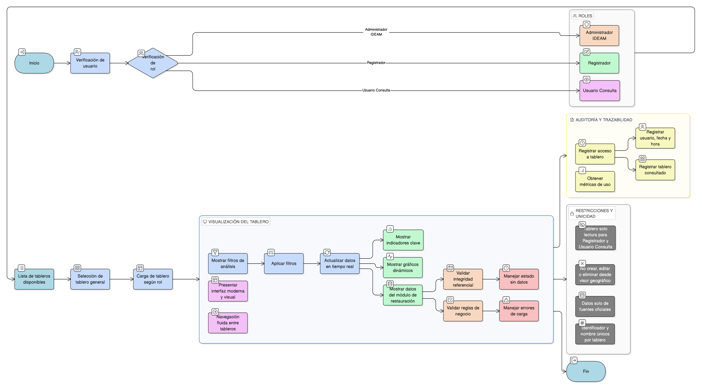

# HU-IDEAM-SNIF-REST-148

> **Identificador Historia de Usuario:** hu-ideam-snif-rest-148\
> **Nombre Historia de Usuario:** Tablero de control general

> **Sistema de información:** Sistema Nacional de Información Forestal\
> **Módulo / subsistema:** Módulo de restauración\
> **Validador temático(s):** Raymond Alexander Jiménez Arteaga

## DESCRIPCIÓN HISTORIA DE USUARIO

> **Como:** usuario autorizado del SNIF.\
> **Quiero:** visualizar un tablero de control general del módulo de restauración.\
> **Para:** monitorear el estado de las acciones, indicadores y validaciones del PIGCCT y apoyar la toma de decisiones.

## CRITERIOS DE ACEPTACIÓN

1. **Acceso al tablero general**\
    1.1 El sistema debe mostrar una vista centralizada de los tableros disponibles del módulo de restauración.\
    1.2 El acceso al tablero general debe estar disponible según rol:
    
    - **Administrador IDEAM**: acceso a visualización y configuración si aplica.  
    - **Registrador**: acceso a visualización detallada.  
    - **Usuario Consulta**: acceso a visualización agregada.

2. **Contenido del tablero**\
    2.1 El tablero general debe incluir, como mínimo:
    
    - Indicadores clave de restauración (por ejemplo: área intervenida, acciones, estados).
    - Gráficos dinámicos (barras, líneas y/o mapas resumen).
    
    2.2 Los datos mostrados deben corresponder únicamente al módulo de restauración.

3. **Filtros de análisis**\
    3.1 El sistema debe permitir filtrar la información del tablero por:
    
    - Periodo.
    - Departamento y/o municipio.
    - Tipo de acción de restauración.
    
    3.2 Los filtros deben actualizar los datos del tablero en tiempo real.

4. **Validaciones funcionales**\
    4.1 El sistema debe manejar explícitamente los estados **“sin datos”** cuando no existan resultados para los filtros aplicados.\
    4.2 El tablero debe cargar correctamente y mostrar mensajes claros ante errores de carga de datos.

5. **Validaciones de negocio**\
    5.1 Los datos y cálculos del tablero deben estar alineados con las definiciones oficiales del SNIF.\
    5.2 El tablero debe utilizar únicamente información validada y publicada.\
    5.3 No se deben mezclar datos del módulo de restauración con otros módulos del sistema.

6. **Integridad referencial (mapa – datos – formularios)**\
    6.1 El sistema debe garantizar la integridad entre:
    
    - Datos mostrados ↔ tablas de restauración.  
    - Filtros aplicados ↔ geometrías territoriales oficiales.  
    
    6.2 El tablero debe reflejar exactamente los datos visibles en el visor geográfico cuando aplique el mismo contexto territorial.

7. **Experiencia de usuario (UX)**\
    7.1 El tablero debe presentar una interfaz moderna, limpia y visual.\
    7.2 Debe utilizar tarjetas de datos con jerarquía visual.\
    7.3 Los filtros deben ser visibles y persistentes.\
    7.4 La navegación entre tableros debe ser fluida.

8. **Auditoría y trazabilidad**\
    8.1 El sistema debe registrar los accesos a los tableros, almacenando como mínimo:
    
    - Usuario.
    - Fecha y hora.
    - Tablero consultado.
    
    8.2 El sistema debe permitir obtener métricas de uso por tablero.

9. **Regla de unicidad**\
    9.1 Cada tablero debe tener un identificador único y un nombre único dentro del módulo de restauración.

## ROLES

- **Administrador IDEAM**: Puede visualizar el tablero y, si aplica, configurar y mantener los tableros.
- **Registrador**: Puede visualizar el tablero con nivel de detalle según permisos.
- **Usuario Consulta**: Puede visualizar el tablero en modo agregado y de consulta.

## RESTRICCIONES Y LÍMITES

- El tablero es de solo lectura para **Registrador** y **Usuario Consulta**.
- No se permite crear, editar o eliminar tableros desde el visor geográfico.
- Los datos mostrados deben provenir únicamente de fuentes oficiales del módulo de restauración.
- El acceso y nivel de detalle de la información está sujeto al rol del usuario.
- Todo acceso al tablero debe quedar registrado en la auditoría del sistema.

## DIAGRAMA DE FLUJO DEL PROCESO

