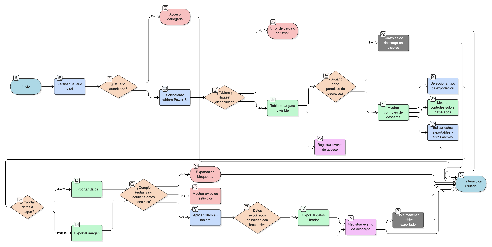

# HU-IDEAM-SNIF-REST-149

> **Identificador Historia de Usuario:** hu-ideam-snif-rest-149\
> **Nombre Historia de Usuario:** Descarga de información desde tableros Power BI

> **Sistema de información:** Sistema Nacional de Información Forestal\
> **Módulo / subsistema:** Módulo de restauración\
> **Validador temático(s):** Raymond Alexander Jiménez Arteaga

## DESCRIPCIÓN HISTORIA DE USUARIO

> **Como:** usuario autorizado del SNIF.\
> **Quiero:** descargar la información disponible en los tableros de control construidos en Power BI.\
> **Para:** analizar los datos de restauración del PIGCCT fuera de la plataforma, sin generar reportes específicos adicionales.

## CRITERIOS DE ACEPTACIÓN

1. **Disponibilidad de tableros Power BI embebidos**\
    1.1 Los tableros de control del módulo de restauración deben estar desarrollados y publicados en Power BI.\
    1.2 El SNIF debe embebir los tableros y permitir su visualización dentro de la plataforma.

2. **Opciones de descarga**\
    2.1 El sistema debe aprovechar las capacidades nativas de Power BI para:
    
    - Exportar datos de visuales (por ejemplo, Excel o CSV).
    - Exportar imágenes de gráficos, si el rol del usuario lo permite.
    
    2.2 No se deben generar reportes personalizados (PDF institucionales) desde el SNIF.

3. **Control de permisos**\
    3.1 Las opciones de exportación deben estar disponibles únicamente si:
    
    - El usuario tiene permisos según su rol.
    - Power BI permite la exportación para el visual seleccionado.
    
    3.2 La disponibilidad de descarga debe estar alineada con:
    
    - Las políticas del IDEAM.
    - Los lineamientos de uso del SNIF.

4. **Validaciones funcionales**\
    4.1 El tablero debe cargar correctamente desde Power BI.\
    4.2 El sistema debe manejar errores de conexión con Power BI y mostrar mensajes claros al usuario.\
    4.3 La exportación debe reflejar los filtros activos aplicados en el tablero.

5. **Validaciones de negocio**\
    5.1 El SNIF no debe transformar ni recalcular los datos descargados.\
    5.2 Los datos exportados deben corresponder exactamente a los datos publicados en Power BI.\
    5.3 No se debe permitir exportar:
    
    - Información sensible no autorizada.
    - Visuales restringidas por el modelo de seguridad.

6. **Integridad referencial (mapa – datos – formularios)**\
    6.1 El sistema debe garantizar la integridad entre:
    
    - Tablero embebido ↔ Dataset de Power BI.  
    - Filtros aplicados ↔ Datos exportados.  
    
    6.2 La información descargada debe coincidir exactamente con:
    
    - Los datos visibles en pantalla.
    - Los filtros territoriales y de análisis activos.

7. **Experiencia de usuario (UX)**\
    7.1 La experiencia debe ser fluida e integrada con Power BI embebido.\
    7.2 Los controles de descarga solo deben ser visibles cuando estén habilitados para el usuario.\
    7.3 El sistema debe indicar claramente:
    
    - Qué datos se pueden exportar.
    - Qué filtros están activos.

8. **Auditoría y trazabilidad**\
    8.1 El sistema debe registrar:
    
    - Accesos a tableros Power BI.
    
    8.2 No se debe almacenar el archivo exportado, únicamente el evento de descarga o acceso.

9. **Regla de unicidad**\
    9.1 Cada tablero Power BI debe tener:
    
    - Un identificador único.
    - Un dataset único asociado.  
        
    9.2 No se debe permitir la duplicación de tableros con la misma finalidad funcional.

## ROLES

- **Administrador IDEAM**: Puede acceder a todos los tableros y a las opciones de descarga según las políticas definidas.
- **Registrador**: Puede acceder a tableros y descargar información según los permisos configurados en Power BI y en el SNIF.
- **Usuario Consulta**: Puede acceder a tableros y descargar información pública según los permisos definidos.

## RESTRICCIONES Y LÍMITES

- El SNIF no genera reportes personalizados; solo se usan las capacidades nativas de Power BI.
- La disponibilidad de descarga depende de la configuración de permisos en Power BI y en el SNIF.
- No se permite la exportación de información sensible o restringida.
- El SNIF no almacena los archivos exportados, solo registra los eventos.
- La visualización y descarga de datos depende de la disponibilidad del servicio Power BI.

## DIAGRAMA DE FLUJO DEL PROCESO

