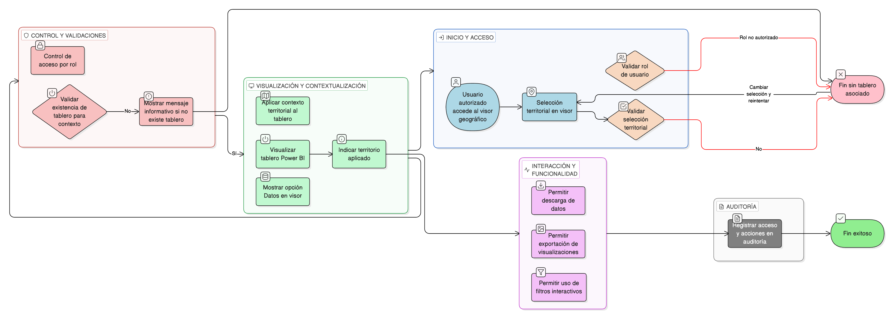

# HU-IDEAM-SNIF-REST-150

> **Identificador Historia de Usuario:** hu-ideam-snif-rest-150\
> **Nombre Historia de Usuario:** Consulta y descarga de información desde tableros Power BI desde el visor geográfico

> **Sistema de información:** Sistema Nacional de Información Forestal\
> **Módulo / subsistema:** Módulo de restauración\
> **Validador temático(s):** Raymond Alexander Jiménez Arteaga

## DESCRIPCIÓN HISTORIA DE USUARIO

> **Como:** usuario autorizado del SNIF.\
> **Quiero:** acceder a tableros Power BI desde el visor geográfico.\
> **Para:** consultar y descargar información de resultados de restauración por municipio o departamento.

## CRITERIOS DE ACEPTACIÓN

1. **Acceso desde el visor geográfico**\
    1.1 El sistema debe ofrecer una opción **“Datos”** o equivalente desde el visor geográfico.\
    1.2 Al seleccionar la opción, el sistema debe abrir o incrustar los tableros Power BI asociados al contexto territorial visible o seleccionado.

2. **Contexto territorial aplicado**\
    2.1 El sistema debe aplicar automáticamente al tablero Power BI el contexto territorial correspondiente a:
    
    - El área visible en el visor, o  
    - La selección territorial activa (municipio o departamento).
    
    2.2 El sistema debe indicar visualmente cuál es el territorio aplicado al tablero.

3. **Funcionalidad de los tableros**\
    3.1 Los tableros Power BI deben permitir:
    
    - Descarga de datos, según permisos del usuario.
    - Exportación de visualizaciones.
    - Uso de filtros interactivos propios de Power BI.
    
    3.2 No se deben generar reportes específicos desde el SNIF; se deben aprovechar exclusivamente las capacidades nativas de Power BI.

4. **Validaciones funcionales**\
    4.1 Debe existir una selección territorial válida en el visor para acceder a los tableros.\
    4.2 El sistema debe validar que exista un tablero Power BI asociado al contexto seleccionado.\
    4.3 Si no existe un tablero asociado, el sistema debe mostrar un mensaje informativo al usuario.

5. **Validaciones de negocio**\
    5.1 Los tableros deben basarse en divisiones territoriales o administrativas oficiales.\
    5.2 Los datos visualizados deben corresponder a información oficial publicada del módulo de restauración.

6. **Integridad referencial**\
    6.1 El sistema debe garantizar la integridad entre:
    
    - Visor ↔ Geometrías ↔ Datos de restauración.  
    - Visor ↔ Tablero Power BI ↔ Contexto territorial aplicado.  
    
    6.2 La información mostrada y descargada debe corresponder exactamente al territorio seleccionado en el visor.

7. **Control por roles**\
    7.1 El acceso a los tableros desde el visor debe estar disponible según rol:
    
    - **Administrador IDEAM**: acceso completo a todos los tableros y datasets.  
    - **Registrador**: acceso a filtros avanzados y exportaciones ampliadas, según configuración.  
    - **Usuario Consulta**: acceso a visualización y descarga básica, según configuración de Power BI.  

8. **Experiencia de usuario (UX)**\
    8.1 El acceso a los tableros debe ser contextual desde el visor geográfico.\
    8.2 El sistema debe permitir una navegación fluida entre el visor y el tablero Power BI.\
    8.3 Los tableros deben abrirse en ventanas independientes del navegador o en vistas embebidas claramente diferenciadas.

9. **Auditoría y trazabilidad**\
    9.1 El sistema debe registrar los accesos a tableros Power BI desde el visor, almacenando como mínimo:
    
    - Usuario.
    - Fecha y hora.
    - Tablero consultado.
    - Contexto territorial aplicado.

## ROLES

- **Administrador IDEAM**: Puede acceder a todos los tableros Power BI desde el visor con control total sobre filtros y descargas.
- **Registrador**: Puede acceder a tableros desde el visor con opciones avanzadas de filtrado y exportación, según configuración.
- **Usuario Consulta**: Puede acceder a tableros desde el visor en modo consulta y con descargas básicas, según permisos definidos.

## RESTRICCIONES Y LÍMITES

- El acceso a tableros depende de que exista una selección territorial válida en el visor.
- No se generan reportes personalizados desde el SNIF; solo se usan las capacidades nativas de Power BI.
- La disponibilidad de exportación está sujeta a los permisos configurados en Power BI y en el SNIF.
- Los tableros son gestionados externamente en Power BI; el SNIF solo los embebe y contextualiza.
- Todo acceso desde el visor debe quedar registrado en la auditoría del sistema.

## DIAGRAMA DE FLUJO DEL PROCESO

