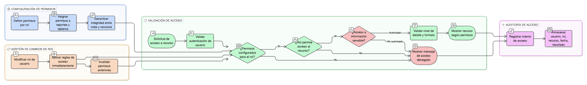

# HU-IDEAM-SNIF-REST-151

> **Identificador Historia de Usuario:** hu-ideam-snif-rest-151\
> **Nombre Historia de Usuario:** Control de acceso a reportes y tableros

> **Sistema de información:** Sistema Nacional de Información Forestal\
> **Módulo / subsistema:** Módulo de restauración\
> **Validador temático(s):** Raymond Alexander Jiménez Arteaga

## DESCRIPCIÓN HISTORIA DE USUARIO

> **Como:** sistema.\
> **Quiero:** controlar el acceso a reportes y tableros según el rol del usuario.\
> **Para:** proteger la información sensible del SNIF y garantizar que cada usuario solo acceda a lo que le corresponde.

## CRITERIOS DE ACEPTACIÓN

1. **Configuración de permisos por rol**\
    1.1 El sistema debe permitir definir permisos de acceso a reportes y tableros según los roles:
    
    - Administrador IDEAM.
    - Registrador.
    - Usuario Consulta.
    
    1.2 Los permisos deben poder restringir tanto el acceso como el nivel de detalle y los formatos disponibles.

2. **Validación de rol en tiempo de acceso**\
    2.1 Antes de mostrar un reporte o tablero, el sistema debe validar el rol del usuario autenticado.\
    2.2 Si el usuario no tiene permisos, el sistema debe mostrar un mensaje claro de **acceso denegado**.

3. **Restricción de información sensible**\
    3.1 La información sensible solo debe ser accesible para los roles autorizados.\
    3.2 El sistema no debe permitir la descarga o visualización de información restringida por ningún medio alterno.

4. **Efecto inmediato de cambios de rol**\
    4.1 Si se modifica el rol de un usuario, el sistema debe aplicar inmediatamente las nuevas reglas de acceso.\
    4.2 No debe existir persistencia de permisos anteriores que permita accesos indebidos.

5. **Integridad referencial**\
    5.1 El sistema debe garantizar la integridad entre:
    
    - Roles ↔ Tableros.  
    - Roles ↔ Reportes.  
    
    5.2 Los permisos configurados deben reflejarse coherentemente en todas las vistas del sistema.

6. **Auditoría y trazabilidad**\
    6.1 El sistema debe registrar los intentos de acceso a reportes y tableros, almacenando como mínimo:
    
    - Usuario.
    - Rol activo.
    - Recurso solicitado (reporte o tablero).
    - Fecha y hora.
    - Resultado del acceso (permitido / denegado).

## ROLES

- **Administrador IDEAM**: Puede acceder a todos los reportes y tableros y configurar permisos según las políticas del sistema.
- **Registrador**: Puede acceder a reportes y tableros según los permisos asignados a su rol.
- **Usuario Consulta**: Puede acceder únicamente a reportes y tableros públicos y autorizados para su rol.

## RESTRICCIONES Y LÍMITES

- El acceso a reportes y tableros está estrictamente controlado por el rol del usuario.
- No se permite el acceso a información sensible a usuarios no autorizados.
- No se permite eludir las restricciones de acceso mediante URLs directas u otros mecanismos.
- Todo intento de acceso debe quedar registrado en la auditoría del sistema.
- Los cambios de permisos deben aplicarse de forma inmediata en todo el sistema.

## DIAGRAMA DE FLUJO DEL PROCESO

