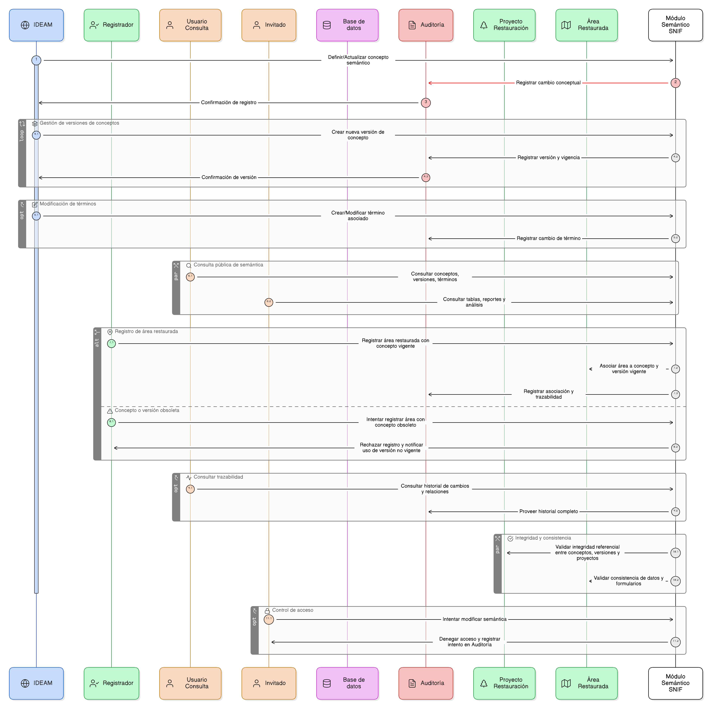

# Épica 015: Gobernanza Semántica para Conceptos de Restauración Ecológica

## 1. Descripción general

Esta épica define la gobernanza semántica del módulo de restauración del SNIF, permitiendo la gestión centralizada, controlada y trazable de los conceptos, definiciones, términos, versiones y relaciones semánticas asociadas a la restauración ecológica.

El IDEAM actúa como autoridad semántica oficial, responsable de definir, versionar y mantener la vigencia de los conceptos del dominio. Los registradores deben asociar obligatoriamente las áreas restauradas a conceptos y versiones vigentes, mientras que los usuarios de consulta e invitados pueden acceder a la semántica desde tablas, reportes y análisis, sin capacidad de modificación.

La épica garantiza:

- Control de vigencia semántica.
- Integridad referencial entre conceptos, versiones, términos, áreas restauradas y proyectos.
- Auditoría completa de cambios conceptuales y semánticos.
- Consistencia entre formularios, datos, reportes y análisis institucionales.

## 2. Objetivo

Gestionar de forma centralizada, controlada y trazable la semántica del dominio de restauración ecológica dentro del SNIF, con el fin de:

- Establecer al IDEAM como autoridad semántica oficial.
- Garantizar el uso obligatorio de conceptos y versiones vigentes en el registro de áreas restauradas.
- Mantener coherencia conceptual entre información operativa, reportes y análisis.
- Preservar la trazabilidad histórica de cambios conceptuales, versiones y relaciones.
- Permitir la consulta pública controlada de la semántica sin capacidad de modificación.

## 3. Historias de usuario asociadas

- [**HU-IDEAM-SNIF-REST-152:** Crear Concepto](/historias_usuario/EP-IDEAM-SNIF-REST-015/HU-IDEAM-SNIF-REST-152.md)
- [**HU-IDEAM-SNIF-REST-153:** Modificar Concepto](/historias_usuario/EP-IDEAM-SNIF-REST-015/HU-IDEAM-SNIF-REST-153.md)
- [**HU-IDEAM-SNIF-REST-154:** Cambiar Estado de Concepto](/historias_usuario/EP-IDEAM-SNIF-REST-015/HU-IDEAM-SNIF-REST-154.md)
- [**HU-IDEAM-SNIF-REST-155:** Consultar/Listar Conceptos](/historias_usuario/EP-IDEAM-SNIF-REST-015/HU-IDEAM-SNIF-REST-155.md)
- [**HU-IDEAM-SNIF-REST-156:** Crear Nueva Versión de Concepto](/historias_usuario/EP-IDEAM-SNIF-REST-015/HU-IDEAM-SNIF-REST-156.md)
- [**HU-IDEAM-SNIF-REST-157:** Finalizar Vigencia de Versión](/historias_usuario/EP-IDEAM-SNIF-REST-015/HU-IDEAM-SNIF-REST-157.md)
- [**HU-IDEAM-SNIF-REST-158:** Consultar Historial de Versiones](/historias_usuario/EP-IDEAM-SNIF-REST-015/HU-IDEAM-SNIF-REST-158.md)
- [**HU-IDEAM-SNIF-REST-159:** Crear Término](/historias_usuario/EP-IDEAM-SNIF-REST-015/HU-IDEAM-SNIF-REST-159.md)
- [**HU-IDEAM-SNIF-REST-160:** Asociar Término a Concepto](/historias_usuario/EP-IDEAM-SNIF-REST-015/HU-IDEAM-SNIF-REST-160.md)
- [**HU-IDEAM-SNIF-REST-161:** Crear Relación entre Conceptos](/historias_usuario/EP-IDEAM-SNIF-REST-015/HU-IDEAM-SNIF-REST-161.md)
- [**HU-IDEAM-SNIF-REST-162:** Consultar Red Semántica](/historias_usuario/EP-IDEAM-SNIF-REST-015/HU-IDEAM-SNIF-REST-162.md)
- [**HU-IDEAM-SNIF-REST-163:** Registrar Área de Restauración con Concepto](/historias_usuario/EP-IDEAM-SNIF-REST-015/HU-IDEAM-SNIF-REST-163.md)
- [**HU-IDEAM-SNIF-REST-164:** Actualizar Versión de Concepto en Áreas Restauradas](/historias_usuario/EP-IDEAM-SNIF-REST-015/HU-IDEAM-SNIF-REST-164.md)
- [**HU-IDEAM-SNIF-REST-165:** Consultar Proyectos y Áreas Restauradas por Concepto/Versión](/historias_usuario/EP-IDEAM-SNIF-REST-015/HU-IDEAM-SNIF-REST-165.md)
- [**HU-IDEAM-SNIF-REST-166:** Consultar Trazabilidad Completa](/historias_usuario/EP-IDEAM-SNIF-REST-015/HU-IDEAM-SNIF-REST-166.md)

## 4. Riesgos

- Uso de conceptos o versiones obsoletas en el registro de áreas restauradas.
- Pérdida de integridad referencial entre conceptos, versiones, términos y proyectos.
- Cambios conceptuales sin trazabilidad completa o sin justificación normativa.
- Ambigüedad semántica por falta de control sobre términos preferidos y sinónimos.
- Impacto institucional por cambios de estado de conceptos con proyectos activos.
- Visualización inconsistente de la semántica en formularios, reportes y análisis.
- Acceso no autorizado a funciones de gobierno semántico.

## 5. Diagrama de secuencia

## 6. Wireframes / mockups
