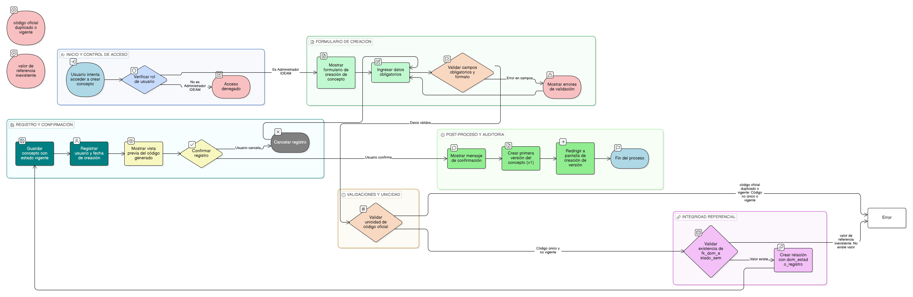

# HU-IDEAM-SNIF-REST-152

> **Identificador Historia de Usuario:** hu-ideam-snif-rest-152\
> **Nombre Historia de Usuario:** Crear concepto

> **Sistema de información:** Sistema Nacional de Información Forestal\
> **Módulo / subsistema:** Módulo de restauración\
> **Validador temático(s):** Raymond Alexander Jiménez Arteaga

## DESCRIPCIÓN HISTORIA DE USUARIO

> **Como:** administrador del sistema.\
> **Quiero:** registrar un nuevo concepto de restauración ecológica.\
> **Para:** establecer la base conceptual oficial del dominio bajo control semántico institucional.

## CRITERIOS DE ACEPTACIÓN

1. **Creación de concepto**\
   1.1 El sistema debe disponer de un formulario de creación de concepto con campos obligatorios.\
   1.2 Los campos obligatorios deben ser:
   - código_oficial
   - dominio
   - estado
   - fecha_creación
   - fuente_normativa

2. **Validaciones funcionales**\
   2.1 El código_oficial debe cumplir el patrón **[A-Z]+-[A-Z]+-\\d{3}** (ejemplo: PNGIBSE-REST-001).\
   2.2 El dominio debe corresponder a un valor de catálogo controlado.\
   2.3 El estado inicial del concepto debe ser siempre **vigente**.\
   2.4 La fecha_creación no puede ser una fecha futura.\
   2.5 La fuente_normativa debe tener mínimo 10 caracteres.

3. **Reglas de unicidad**\
   3.1 El código_oficial debe ser único en la tabla de conceptos.\
   3.2 No se debe permitir la creación de dos conceptos vigentes con el mismo código_oficial.

4. **Integridad referencial**\
   4.1 El sistema debe validar la existencia del valor fk_dom_estado_sem en la tabla dom_estado_sem.\
   4.2 Al crear el concepto, el sistema debe crear automáticamente la relación con dom_estado_registro.

5. **Control por roles**\
   5.1 Solo los usuarios con rol **Administrador IDEAM** pueden crear conceptos.\
   5.2 Ningún otro rol del sistema debe tener acceso a esta funcionalidad.

6. **Experiencia de usuario (UX)**\
   6.1 Al guardar el concepto, el sistema debe mostrar un mensaje de confirmación.\
   6.2 El sistema debe redirigir automáticamente a la creación de la primera versión del concepto.\
   6.3 El sistema debe mostrar una vista previa del código generado antes de confirmar el registro.

7. **Auditoría**\
   7.1 El sistema debe registrar el usuario creador y la fecha de creación del concepto.

## ROLES

- **Administrador IDEAM**: Puede crear conceptos.
- **Registrador**: No puede realizar esta acción.
- **Consulta**: No puede realizar esta acción.

## RESTRICCIONES Y LÍMITES

- No se permite la creación de conceptos por roles distintos a Administrador IDEAM.
- No se permite registrar conceptos con código_oficial duplicado.
- El estado del concepto no puede ser definido por el usuario en la creación, siempre inicia como vigente.
- Al crear un concepto, debe generarse obligatoriamente su primera versión (v1).

## DIAGRAMA DE FLUJO DEL PROCESO

