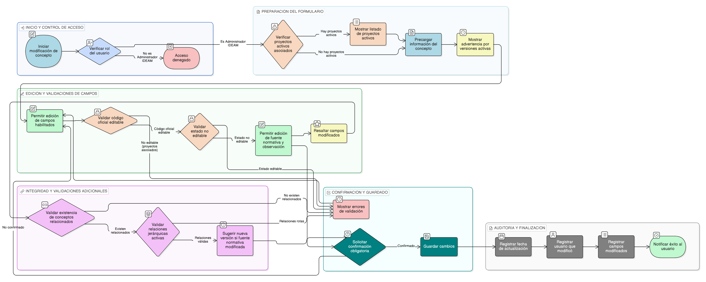

# HU-IDEAM-SNIF-REST-153

> **Identificador Historia de Usuario:** hu-ideam-snif-rest-153\
> **Nombre Historia de Usuario:** Modificar concepto

> **Sistema de información:** Sistema Nacional de Información Forestal\
> **Módulo / subsistema:** Módulo de restauración\
> **Validador temático(s):** Raymond Alexander Jiménez Arteaga

## DESCRIPCIÓN HISTORIA DE USUARIO

> **Como:** administrador del sistema.\
> **Quiero:** actualizar la información de un concepto de restauración ecológica.\
> **Para:** corregir errores o actualizar metadatos sin perder integridad semántica.

## CRITERIOS DE ACEPTACIÓN

1. **Edición de concepto**\
   1.1 El sistema debe disponer de un formulario de edición con la información del concepto precargada.\
   1.2 El formulario debe permitir la actualización únicamente de los campos habilitados.

2. **Validaciones funcionales**\
   2.1 No se debe permitir modificar el código_oficial si el concepto tiene proyectos asociados.\
   2.2 No se debe permitir cambiar el estado del concepto directamente desde el formulario de edición.\
   2.3 Los campos fuente_normativa y observación deben ser siempre editables.

3. **Integridad referencial**\
   3.1 El sistema debe validar la existencia de conceptos relacionados en la tabla concepto_relacion.\
   3.2 El sistema debe validar que las modificaciones no rompan relaciones jerárquicas activas.

4. **Control por roles**\
   4.1 Solo los usuarios con rol **Administrador IDEAM** pueden modificar conceptos.\
   4.2 Ningún otro rol debe tener acceso a esta funcionalidad.

5. **Experiencia de usuario (UX)**\
   5.1 El sistema debe mostrar una advertencia si el concepto tiene versiones activas.\
   5.2 Los campos modificados deben resaltarse visualmente.\
   5.3 El sistema debe solicitar confirmación obligatoria antes de guardar los cambios.

6. **Auditoría**\
   6.1 El sistema debe registrar la fecha de actualización del concepto.\
   6.2 El sistema debe registrar el usuario que realizó la modificación.\
   6.3 El sistema debe registrar los campos que fueron modificados.

## ROLES

- **Administrador IDEAM**: Puede modificar conceptos.
- **Registrador**: No puede realizar esta acción.
- **Consulta**: No puede realizar esta acción.

## RESTRICCIONES Y LÍMITES

- No se permite modificar el código_oficial cuando el concepto tiene proyectos activos asociados.
- No se permite el cambio directo de estado del concepto desde esta funcionalidad.
- Si el concepto tiene proyectos activos, el sistema debe mostrar el listado antes de permitir la edición.
- Si se modifica la fuente_normativa, el sistema debe sugerir la creación de una nueva versión del concepto.

## DIAGRAMA DE FLUJO DEL PROCESO

