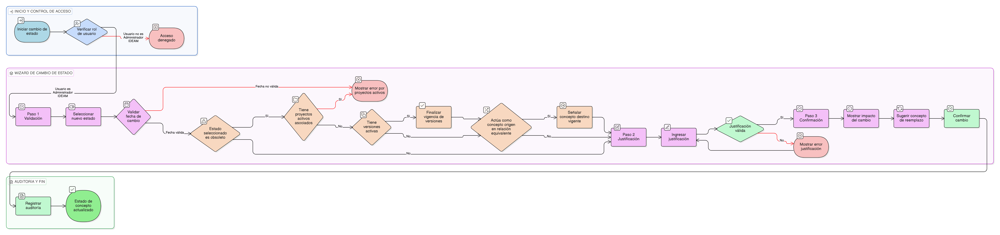

# HU-IDEAM-SNIF-REST-154

> **Identificador Historia de Usuario:** hu-ideam-snif-rest-154\
> **Nombre Historia de Usuario:** Cambiar estado de concepto

> **Sistema de información:** Sistema Nacional de Información Forestal\
> **Módulo / subsistema:** Módulo de restauración\
> **Validador temático(s):** Raymond Alexander Jiménez Arteaga

## DESCRIPCIÓN HISTORIA DE USUARIO

> **Como:** administrador del sistema.\
> **Quiero:** cambiar el estado de un concepto de restauración ecológica.\
> **Para:** reflejar cambios normativos o procesos de unificación conceptual bajo gobierno semántico.

## CRITERIOS DE ACEPTACIÓN

1. **Cambio de estado del concepto**\
   1.1 El sistema debe disponer de un modal para el cambio de estado del concepto.\
   1.2 El cambio de estado debe requerir una justificación obligatoria.

2. **Validaciones funcionales**\
   2.1 Los estados permitidos deben ser:
   - vigente
   - obsoleto
   - en_revisión
   
   2.2 La justificación debe tener un mínimo de 50 caracteres.\
   2.3 La fecha de cambio no puede ser anterior a la fecha_creación del concepto.\
   2.4 El cambio de estado debe considerarse un acto de gobierno semántico y no operativo.

3. **Integridad referencial**\
   3.1 Si el concepto cambia a estado **obsoleto**, todas sus versiones activas deben finalizar su vigencia, cuando aplique.\
   3.2 Si el concepto tiene proyectos activos asociados, no se debe permitir el cambio a estado **obsoleto**, cuando aplique.\
   3.3 Si el concepto actúa como concepto_origen en una relación de tipo **equivalente**, el sistema debe señalar un concepto_destino vigente, cuando aplique.

4. **Control por roles**\
   4.1 Solo los usuarios con rol **Administrador IDEAM** pueden cambiar el estado de un concepto.

5. **Experiencia de usuario (UX)**\
   5.1 El sistema debe implementar un wizard de 3 pasos:
   - Validación
   - Justificación
   - Confirmación

   5.2 El sistema debe mostrar el impacto del cambio, indicando:

   - Número de versiones afectadas
   - Número de términos asociados
   - Número de proyectos afectados

   5.3 El sistema debe permitir sugerir un concepto de reemplazo.

6. **Auditoría**\
   6.1 El sistema debe registrar:
   - estado_anterior
   - estado_nuevo
   - justificación
   - fecha_cambio

## ROLES

- **Administrador IDEAM**: Puede cambiar el estado de conceptos.
- **Registrador**: No puede realizar esta acción.
- **Consulta**: No puede realizar esta acción.

## RESTRICCIONES Y LÍMITES

- No se permite el cambio de estado sin justificación.
- No se permite marcar como obsoleto un concepto con proyectos activos asociados, cuando aplique.
- El cambio de estado no puede realizarse por usuarios distintos al Administrador IDEAM.
- El impacto del cambio debe ser visible antes de la confirmación final.

## DIAGRAMA DE FLUJO DEL PROCESO

