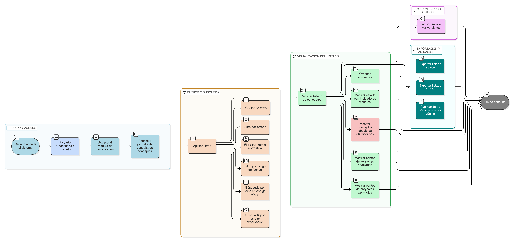

# HU-IDEAM-SNIF-REST-155

> **Identificador Historia de Usuario:** hu-ideam-snif-rest-155\
> **Nombre Historia de Usuario:** Consultar y listar conceptos

> **Sistema de información:** Sistema Nacional de Información Forestal\
> **Módulo / subsistema:** Módulo de restauración\
> **Validador temático(s):** Raymond Alexander Jiménez Arteaga

## DESCRIPCIÓN HISTORIA DE USUARIO

> **Como:** usuario del sistema.\
> **Quiero:** buscar y visualizar conceptos de restauración ecológica.\
> **Para:** conocer la terminología oficial vigente y su estado dentro del marco semántico institucional.

## CRITERIOS DE ACEPTACIÓN

1. **Listado de conceptos**\
   1.1 El sistema debe disponer de una vista de listado de conceptos.\
   1.2 La vista debe permitir la consulta de conceptos vigentes y obsoletos.

2. **Filtros y búsqueda**\
   2.1 El sistema debe permitir filtrar los conceptos por:
   - dominio (selección múltiple)
   - estado (vigente, obsoleto, todos)
   - fuente_normativa
   - rango de fechas de creación\

   2.2 El sistema debe permitir la búsqueda por texto en el código_oficial u observación.

3. **Control por roles**\
   3.1 Todos los usuarios autenticados e invitados deben poder consultar los conceptos.

4. **Experiencia de usuario (UX)**\
   4.1 El listado debe presentarse en una grilla con ordenamiento por columnas.\
   4.2 El sistema debe mostrar indicadores visuales del estado del concepto.\
   4.3 Cada registro debe contar con una acción rápida para **“Ver versiones”**.\
   4.4 El sistema debe permitir la exportación del listado a formatos Excel y PDF.\
   4.5 La vista debe contar con paginación de 25 registros por página.

5. **Integridad referencial**\
   5.1 El sistema debe mostrar el conteo de versiones asociadas a cada concepto.\
   5.2 El sistema debe mostrar el conteo de proyectos asociados a cada concepto.

## ROLES

- **Administrador IDEAM**: Puede consultar conceptos.
- **Registrador**: Puede consultar conceptos.
- **Consulta**: Puede consultar conceptos.
- **Invitado**: Puede consultar conceptos.

## RESTRICCIONES Y LÍMITES

- La funcionalidad es únicamente de consulta, no permite modificaciones.
- Los conceptos obsoletos deben mostrarse claramente identificados.
- La información presentada debe reflejar el estado actual del concepto y sus relaciones.

## DIAGRAMA DE FLUJO DEL PROCESO

