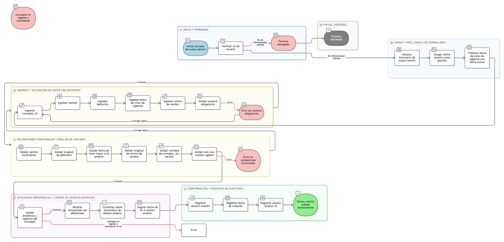

# HU-IDEAM-SNIF-REST-156

> **Identificador Historia de Usuario:** hu-ideam-snif-rest-156\
> **Nombre Historia de Usuario:** Crear nueva versión de concepto

> **Sistema de información:** Sistema Nacional de Información Forestal\
> **Módulo / subsistema:** Módulo de restauración\
> **Validador temático(s):** Raymond Alexander Jiménez Arteaga

## DESCRIPCIÓN HISTORIA DE USUARIO

> **Como:** administrador del sistema.\
> **Quiero:** crear una nueva versión de un concepto de restauración ecológica existente.\
> **Para:** reflejar ajustes en la definición sin perder la trazabilidad histórica del marco conceptual.

## CRITERIOS DE ACEPTACIÓN

1. **Creación de nueva versión**\
   1.1 El sistema debe disponer de un formulario para crear una nueva versión del concepto.\
   1.2 El formulario debe cargar la última versión del concepto como plantilla inicial.

2. **Campos obligatorios**\
   2.1 Los campos obligatorios deben ser:
   - concepto_id
   - versión
   - definición
   - fecha_inicio_vigencia
   - motivo_cambio

3. **Validaciones funcionales**\
   3.1 La versión debe ser incremental respecto a la última versión existente.\
   3.2 La definición debe tener un mínimo de 50 caracteres.\
   3.3 La fecha_inicio_vigencia debe ser mayor a la fecha_fin_vigencia de la versión anterior.\
   3.4 El motivo_cambio debe tener un mínimo de 30 caracteres.\
   3.5 Solo puede existir una versión con fecha_fin_vigencia igual a NULL por concepto.

4. **Reglas de unicidad**\
   4.1 La combinación (concepto_id, versión) debe ser única.

5. **Integridad referencial**\
   5.1 Al crear una nueva versión, el sistema debe cerrar automáticamente la versión anterior, asignando:
   - fecha_fin_vigencia = fecha_inicio_vigencia - 1 día
   
   5.2 El sistema debe validar que el concepto exista y se encuentre vigente.

6. **Control por roles**\
   6.1 Solo los usuarios con rol **Administrador IDEAM** pueden crear nuevas versiones de concepto.

7. **Experiencia de usuario (UX)**\
   7.1 El sistema debe mostrar un comparador de diferencias entre la definición anterior y la nueva.\
   7.2 La fecha_inicio_vigencia debe prellenarse con la fecha actual.\
   7.3 El sistema debe incluir una opción para cerrar automáticamente la versión anterior.

8. **Auditoría**\
   8.1 El sistema debe registrar:
   - usuario_creador
   - fecha_creación
   - versión_anterior_id

## ROLES

- **Administrador IDEAM**: Puede crear nuevas versiones de conceptos.
- **Registrador**: No puede realizar esta acción.
- **Consulta**: No puede realizar esta acción.

## RESTRICCIONES Y LÍMITES

- No se permite crear versiones para conceptos no vigentes.
- No se permite más de una versión vigente simultáneamente por concepto.
- La creación de una nueva versión implica el cierre automático de la versión anterior.

## DIAGRAMA DE FLUJO DEL PROCESO

