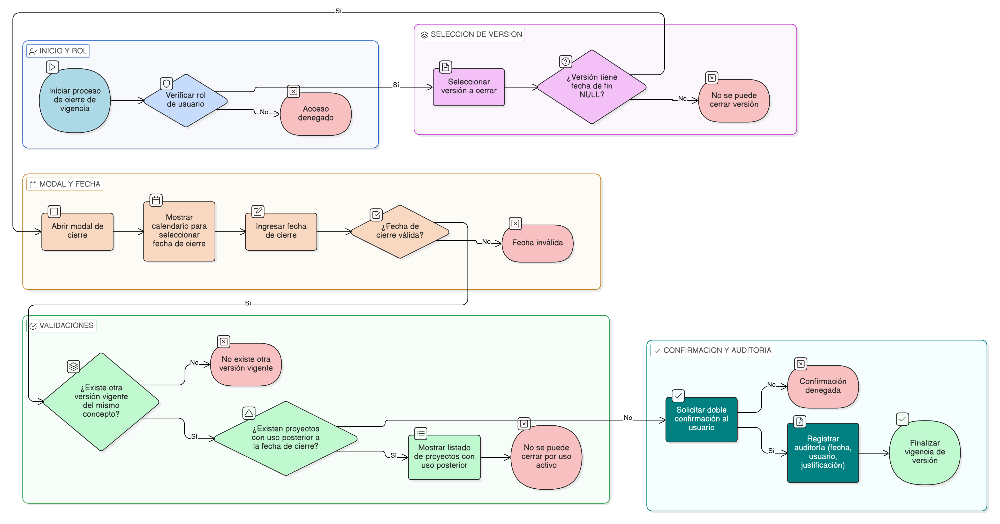

# HU-IDEAM-SNIF-REST-157

> **Identificador Historia de Usuario:** hu-ideam-snif-rest-157\
> **Nombre Historia de Usuario:** Finalizar vigencia de versión

> **Sistema de información:** Sistema Nacional de Información Forestal\
> **Módulo / subsistema:** Módulo de restauración\
> **Validador temático(s):** Raymond Alexander Jiménez Arteaga

## DESCRIPCIÓN HISTORIA DE USUARIO

> **Como:** administrador del sistema.\
> **Quiero:** cerrar la vigencia de una versión específica de un concepto de restauración ecológica.\
> **Para:** reflejar que dicha versión ya no se encuentra en uso oficial dentro del marco conceptual.

## CRITERIOS DE ACEPTACIÓN

1. **Cierre de vigencia de versión**\
   1.1 El sistema debe disponer de un modal para finalizar la vigencia de una versión de concepto.\
   1.2 El modal debe permitir la selección de la fecha de fin de vigencia.

2. **Validaciones funcionales**\
   2.1 La fecha_fin debe ser mayor o igual a la fecha_inicio_vigencia de la versión.\
   2.2 La fecha_fin no puede ser una fecha futura.\
   2.3 Solo las versiones con fecha_fin_vigencia igual a NULL pueden cerrarse.

3. **Integridad referencial**\
   3.1 Si existen proyectos registrados que utilicen la versión después de la fecha_fin, el sistema debe mostrar un error.\
   3.2 El sistema debe validar que exista al menos otra versión vigente del mismo concepto.

4. **Control por roles**\
   4.1 Solo los usuarios con rol **Administrador IDEAM** pueden finalizar la vigencia de versiones.

5. **Experiencia de usuario (UX)**\
   5.1 El sistema debe mostrar un calendario para seleccionar la fecha de cierre.\
   5.2 El sistema debe mostrar el listado de proyectos que usan la versión.\
   5.3 El sistema debe solicitar confirmación con doble verificación antes de cerrar la vigencia.

6. **Auditoría**\
   6.1 El sistema debe registrar:
   - fecha_cierre
   - usuario_cierre
   - justificación

## ROLES

- **Administrador IDEAM**: Puede finalizar la vigencia de versiones.
- **Registrador**: No puede realizar esta acción.
- **Consulta**: No puede realizar esta acción.

## RESTRICCIONES Y LÍMITES

- No se permite cerrar la vigencia de una versión si no existe otra versión vigente del mismo concepto.
- No se permite cerrar versiones con uso activo posterior a la fecha de cierre.
- El cierre de vigencia debe quedar completamente auditado.

## DIAGRAMA DE FLUJO DEL PROCESO

