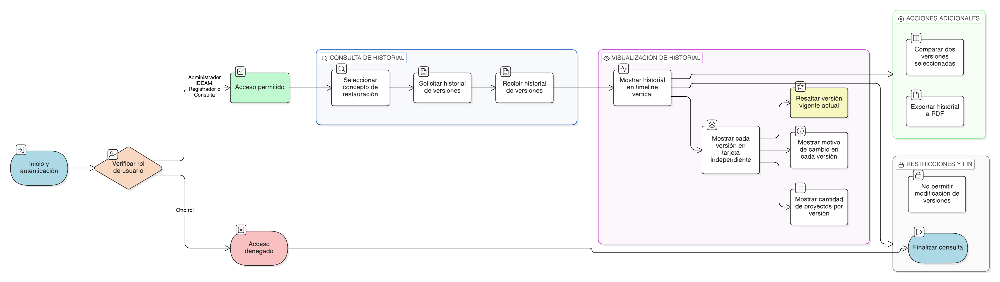

# HU-IDEAM-SNIF-REST-158

> **Identificador Historia de Usuario:** hu-ideam-snif-rest-158\
> **Nombre Historia de Usuario:** Consultar historial de versiones

> **Sistema de información:** Sistema Nacional de Información Forestal\
> **Módulo / subsistema:** Módulo de restauración\
> **Validador temático(s):** Raymond Alexander Jiménez Arteaga

## DESCRIPCIÓN HISTORIA DE USUARIO

> **Como:** usuario técnico.\
> **Quiero:** visualizar el historial completo de versiones de un concepto de restauración ecológica.\
> **Para:** comprender la evolución del marco conceptual a lo largo del tiempo.

## CRITERIOS DE ACEPTACIÓN

1. **Consulta de historial de versiones**\
   1.1 El sistema debe disponer de una vista que muestre todas las versiones asociadas a un concepto.\
   1.2 Las versiones deben presentarse en orden cronológico.

2. **Control por roles**\
   2.1 Todos los usuarios autenticados y de consulta deben poder acceder al historial de versiones.

3. **Experiencia de usuario (UX)**\
   3.1 El historial debe visualizarse mediante un timeline vertical.\
   3.2 Cada versión debe mostrarse en una tarjeta independiente.\
   3.3 El sistema debe resaltar visualmente la versión vigente actual.\
   3.4 El sistema debe permitir comparar dos versiones seleccionadas de forma lado a lado.\
   3.5 El sistema debe mostrar el motivo_cambio en cada versión.\
   3.6 El sistema debe permitir exportar el historial completo a formato PDF.

4. **Integridad referencial**\
   4.1 El sistema debe mostrar la cantidad de proyectos que utilizaron cada versión del concepto.

## ROLES

- **Administrador IDEAM**: Puede consultar el historial de versiones.
- **Registrador**: Puede consultar el historial de versiones.
- **Consulta**: Puede consultar el historial de versiones.

## RESTRICCIONES Y LÍMITES

- La funcionalidad es exclusivamente de consulta.
- No se permite la modificación de versiones desde esta vista.
- La información presentada debe reflejar fielmente el estado histórico y vigente de cada versión.

## DIAGRAMA DE FLUJO DEL PROCESO

