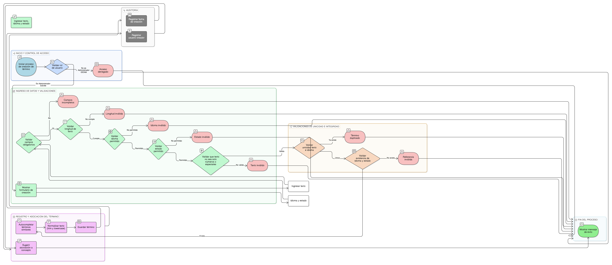

# HU-IDEAM-SNIF-REST-159

> **Identificador Historia de Usuario:** hu-ideam-snif-rest-159\
> **Nombre Historia de Usuario:** Crear término

> **Sistema de información:** Sistema Nacional de Información Forestal\
> **Módulo / subsistema:** Módulo de restauración\
> **Validador temático(s):** Raymond Alexander Jiménez Arteaga

## DESCRIPCIÓN HISTORIA DE USUARIO

> **Como:** administrador del sistema.\
> **Quiero:** registrar un término (palabra o frase).\
> **Para:** establecer el vocabulario controlado del dominio de restauración ecológica.

## CRITERIOS DE ACEPTACIÓN

1. **Creación de término**\
   1.1 El sistema debe disponer de un formulario simple para la creación de términos.\
   1.2 El formulario debe contar con tres campos obligatorios:
   - texto
   - idioma
   - estado

2. **Validaciones funcionales**\
   2.1 El texto del término debe tener un mínimo de 3 y un máximo de 100 caracteres.\
   2.2 El idioma debe seleccionarse desde un catálogo controlado (es, en, pt).\
   2.3 El estado del término debe ser **vigente** u **obsoleto**.\
   2.4 El texto no puede contener únicamente números o caracteres especiales.

3. **Reglas de unicidad**\
   3.1 La combinación (texto, idioma) debe ser única.\
   3.2 La validación de unicidad debe realizarse sin distinguir mayúsculas y minúsculas.

4. **Integridad referencial**\
   4.1 El sistema debe validar la existencia del fk_dom_idioma.\
   4.2 El sistema debe validar la existencia del fk_dom_estado_sem.

5. **Control por roles**\
   5.1 Solo los usuarios con rol **Administrador IDEAM** pueden crear términos.

6. **Experiencia de usuario (UX)**\
   6.1 El sistema debe mostrar autocompletado con términos similares existentes.\
   6.2 Al guardar el término, el sistema debe sugerir su asociación a un concepto.\
   6.3 El sistema debe normalizar automáticamente el texto para búsqueda (trim y lowercase).

7. **Auditoría**\
   7.1 El sistema debe registrar la fecha de creación del término.\
   7.2 El sistema debe registrar el usuario creador.

## ROLES

- **Administrador IDEAM**: Puede crear términos.
- **Registrador**: No puede realizar esta acción.
- **Consulta**: No puede realizar esta acción.

## RESTRICCIONES Y LÍMITES

- No se permite la creación de términos duplicados por texto e idioma.
- Un término no tiene validez operativa si no está asociado a un concepto.
- La creación de términos está restringida exclusivamente al Administrador IDEAM.

## DIAGRAMA DE FLUJO DEL PROCESO

