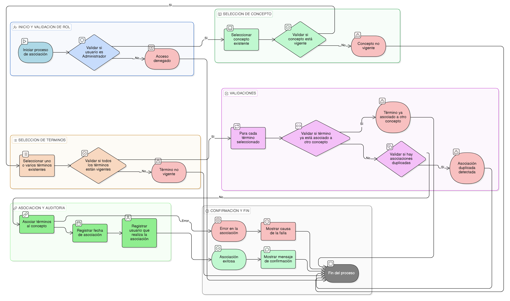

# HU-IDEAM-SNIF-REST-160

> **Identificador Historia de Usuario:** hu-ideam-snif-rest-160\
> **Nombre Historia de Usuario:** Asociar término a concepto

> **Sistema de información:** Sistema Nacional de Información Forestal\
> **Módulo / subsistema:** Módulo de restauración\
> **Validador temático(s):** Raymond Alexander Jiménez Arteaga

## DESCRIPCIÓN HISTORIA DE USUARIO

> **Como:** administrador del sistema.\
> **Quiero:** asociar uno o varios términos a un concepto.\
> **Para:** estructurar el vocabulario controlado del dominio de restauración ecológica.

## CRITERIOS DE ACEPTACIÓN

1. **Selección de concepto**\
   1.1 El sistema debe permitir seleccionar un concepto existente.\
   1.2 El concepto debe encontrarse en estado vigente.

2. **Selección de términos**\
   2.1 El sistema debe permitir seleccionar uno o varios términos existentes.\
   2.2 Los términos seleccionados deben encontrarse en estado vigente.

3. **Asociación término–concepto**\
   3.1 El sistema debe permitir asociar múltiples términos a un mismo concepto.\
   3.2 Un término solo puede estar asociado a un concepto a la vez.

4. **Validaciones**\
   4.1 El sistema debe validar que el término no se encuentre previamente asociado a otro concepto.\
   4.2 El sistema debe impedir asociaciones duplicadas.

5. **Confirmación de la operación**\
   5.1 El sistema debe mostrar un mensaje de confirmación al realizar la asociación correctamente.\
   5.2 En caso de error, el sistema debe informar la causa de la falla.

6. **Auditoría**\
   6.1 El sistema debe registrar la fecha de la asociación.\
   6.2 El sistema debe registrar el usuario que realiza la asociación.

## ROLES

- **Administrador IDEAM**: Puede asociar términos a conceptos.
- **Registrador**: No puede realizar esta acción.
- **Consulta**: No puede realizar esta acción.

## RESTRICCIONES Y LÍMITES

- No se permite asociar un término obsoleto a un concepto.
- No se permite que un término esté asociado a más de un concepto.
- La asociación solo puede ser realizada por un usuario administrador.

## DIAGRAMA DE FLUJO DEL PROCESO

