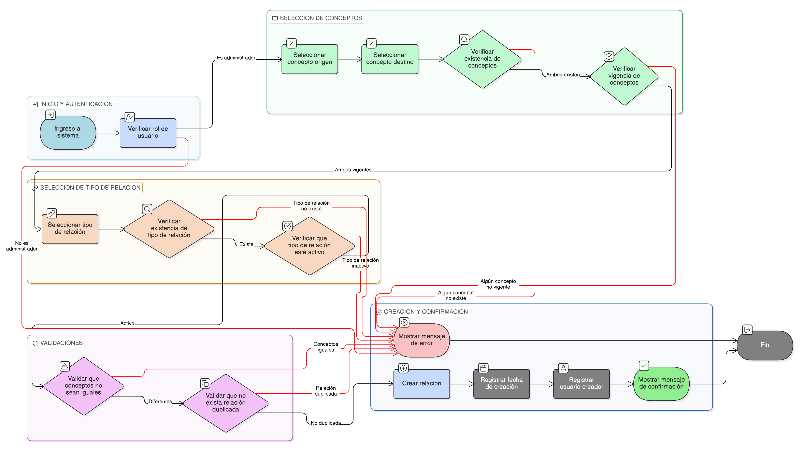

# HU-IDEAM-SNIF-REST-161

> **Identificador Historia de Usuario:** hu-ideam-snif-rest-161\
> **Nombre Historia de Usuario:** Crear relación entre conceptos

> **Sistema de información:** Sistema Nacional de Información Forestal\
> **Módulo / subsistema:** Módulo de restauración\
> **Validador temático(s):** Raymond Alexander Jiménez Arteaga

## DESCRIPCIÓN HISTORIA DE USUARIO

> **Como:** administrador del sistema.\
> **Quiero:** crear una relación entre conceptos.\
> **Para:** estructurar jerárquica y semánticamente el vocabulario controlado del dominio de restauración ecológica.

## CRITERIOS DE ACEPTACIÓN

1. **Selección de conceptos**\
   1.1 El sistema debe permitir seleccionar un concepto origen.\
   1.2 El sistema debe permitir seleccionar un concepto destino.\
   1.3 Ambos conceptos deben encontrarse en estado vigente.

2. **Tipo de relación**\
   2.1 El sistema debe permitir seleccionar un tipo de relación desde un catálogo controlado.\
   2.2 El tipo de relación debe encontrarse activo.

3. **Creación de la relación**\
   3.1 El sistema debe permitir crear la relación entre el concepto origen y el concepto destino.\
   3.2 El sistema debe impedir la creación de relaciones duplicadas.

4. **Validaciones**\
   4.1 El sistema debe impedir que un concepto se relacione consigo mismo.\
   4.2 El sistema debe validar la existencia del concepto origen y destino.\
   4.3 El sistema debe validar la existencia del tipo de relación.

5. **Confirmación de la operación**\
   5.1 El sistema debe mostrar un mensaje de confirmación al crear la relación exitosamente.\
   5.2 En caso de error, el sistema debe informar la causa.

6. **Auditoría**\
   6.1 El sistema debe registrar la fecha de creación de la relación.\
   6.2 El sistema debe registrar el usuario que crea la relación.

## ROLES

- **Administrador IDEAM**: Puede crear relaciones entre conceptos.
- **Registrador**: No puede realizar esta acción.
- **Consulta**: No puede realizar esta acción.

## RESTRICCIONES Y LÍMITES

- No se permite crear relaciones entre conceptos obsoletos.
- No se permite la duplicidad de relaciones entre los mismos conceptos y tipo.
- La creación de relaciones está restringida al rol administrador.

## DIAGRAMA DE FLUJO DEL PROCESO

