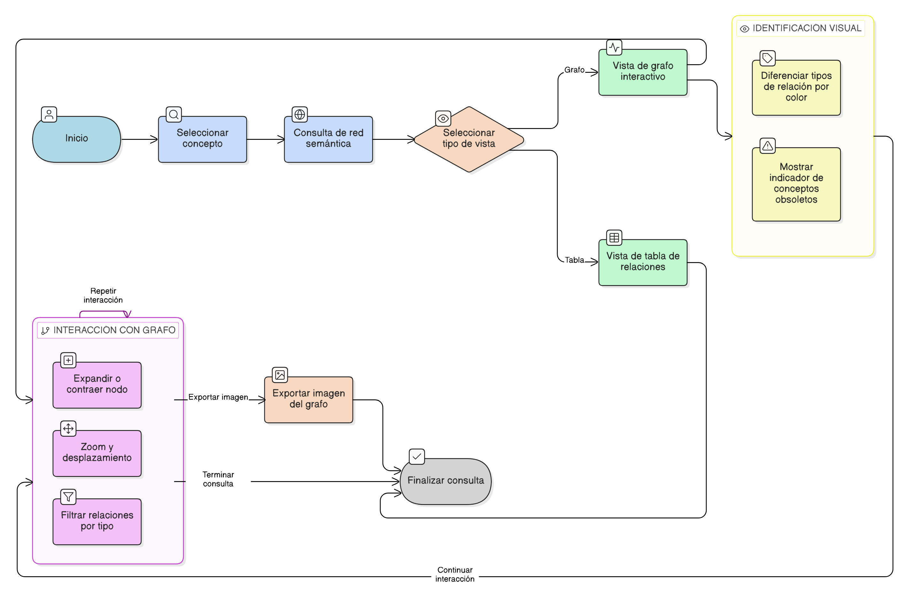

# HU-IDEAM-SNIF-REST-162

> **Identificador Historia de Usuario:** hu-ideam-snif-rest-162\
> **Nombre Historia de Usuario:** Consultar red semántica

> **Sistema de información:** Sistema Nacional de Información Forestal\
> **Módulo / subsistema:** Módulo de restauración\
> **Validador temático(s):** Raymond Alexander Jiménez Arteaga

## DESCRIPCIÓN HISTORIA DE USUARIO

> **Como:** usuario.\
> **Quiero:** visualizar las relaciones de un concepto.\
> **Para:** entender su contexto en la ontología.

## CRITERIOS DE ACEPTACIÓN

1. **Consulta de la red semántica**\
   1.1 El sistema debe permitir la consulta de la red semántica asociada a un concepto.\
   1.2 La consulta debe presentarse mediante una vista de grafo interactivo.

2. **Visualización del grafo**\
   2.1 El grafo debe representar los conceptos como nodos.\
   2.2 Las relaciones entre conceptos deben representarse como aristas.\
   2.3 Los nodos y aristas deben construirse usando una visualización tipo D3.js.

3. **Interacción con el grafo**\
   3.1 El usuario debe poder hacer clic sobre un nodo para expandir o contraer sus relaciones.\
   3.2 El grafo debe permitir zoom y desplazamiento (pan).\
   3.3 El usuario debe poder filtrar las relaciones por tipo de relación.

4. **Identificación visual**\
   4.1 El sistema debe usar colores para diferenciar los tipos de relación.\
   4.2 El sistema debe mostrar un indicador visual cuando existan conceptos obsoletos en la red.

5. **Vistas alternativas**\
   5.1 El sistema debe permitir visualizar la información en una vista alternativa tipo tabla de relaciones.

6. **Exportación**\
   6.1 El sistema debe permitir exportar una imagen del grafo.

## ROLES

## ROLES

- **Administrador IDEAM:** Puede realizar la acción.
- **Registrador:** Puede realizar la acción.
- **Consulta:** Puede realizar la acción.

## RESTRICCIONES Y LÍMITES

- La funcionalidad corresponde únicamente a una operación de consulta (CRUD).
- No se permite la edición de conceptos ni relaciones desde la red semántica.

## DIAGRAMA DE FLUJO DEL PROCESO

