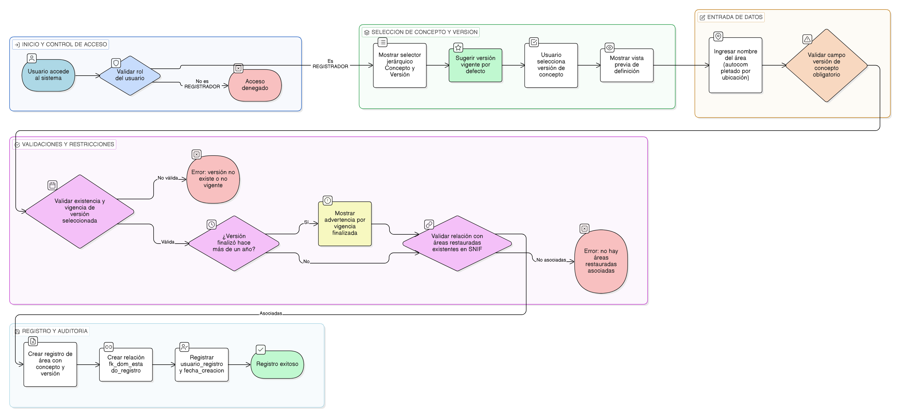

# HU-IDEAM-SNIF-REST-163

> **Identificador Historia de Usuario:** hu-ideam-snif-rest-163\
> **Nombre Historia de Usuario:** Registrar área de restauración con concepto

> **Sistema de información:** Sistema Nacional de Información Forestal\
> **Módulo / subsistema:** Módulo de restauración\
> **Validador temático(s):** Raymond Alexander Jiménez Arteaga

## DESCRIPCIÓN HISTORIA DE USUARIO

> **Como:** registrador.\
> **Quiero:** registrar un área de restauración asociándola a una versión específica de concepto.\
> **Para:** garantizar trazabilidad conceptual.

## CRITERIOS DE ACEPTACIÓN

1. **Registro del área de restauración**\
   1.1 El sistema debe permitir registrar un área de restauración.\
   1.2 El registro debe estar asociado a una versión específica de concepto de restauración.

2. **Campos obligatorios**\
   2.1 El campo **concepto_restauracion_version_id** debe ser obligatorio.

3. **Validaciones funcionales**\
   3.1 El sistema debe permitir seleccionar únicamente versiones vigentes al momento del registro.

4. **Integridad referencial**\
   4.1 El valor de **concepto_restauracion_version_id** debe existir en **concepto_version**.\
   4.2 El sistema debe validar que la versión seleccionada esté vigente en la **fecha_registro**.\
   4.3 El sistema debe crear automáticamente la relación con **fk_dom_estado_registro**.

5. **Validaciones críticas**\
   5.1 El sistema debe validar la relación del área con áreas restauradas existentes en el módulo SNIF.

6. **Control por roles**\
   6.1 Solo los usuarios con rol **REGISTRADOR** pueden realizar el registro.

7. **Experiencia de usuario (UX)**\
   7.1 El sistema debe presentar un selector jerárquico **Concepto → Versión**.\
   7.2 Al seleccionar una versión, el sistema debe mostrar una vista previa de su definición.\
   7.3 El sistema debe ofrecer autocompletado del nombre del área basado en la ubicación.\
   7.4 El sistema debe sugerir por defecto la versión vigente del concepto.

8. **Auditoría**\
   8.1 El sistema debe registrar el **usuario_registro**.\
   8.2 El sistema debe registrar la **fecha_creacion**.

9. **Validaciones de negocio**\
   9.1 Si se selecciona una versión cuya vigencia finalizó hace más de un año, el sistema debe mostrar una advertencia.\
   9.2 El sistema debe validar que el proyecto tenga al menos un área restaurada asociada en el módulo SNIF antes de permitir su activación.

## ROLES

- **Administrador IDEAM:** No puede realizar la acción.
- **Registrador**: Puede registrar áreas de restauración con concepto.
- **Consulta:** No puede realizar la acción.

## RESTRICCIONES Y LÍMITES

- No se permite registrar áreas con versiones de concepto no vigentes.
- El registro depende de la existencia de áreas restauradas asociadas en el módulo SNIF.

## DIAGRAMA DE FLUJO DEL PROCESO

