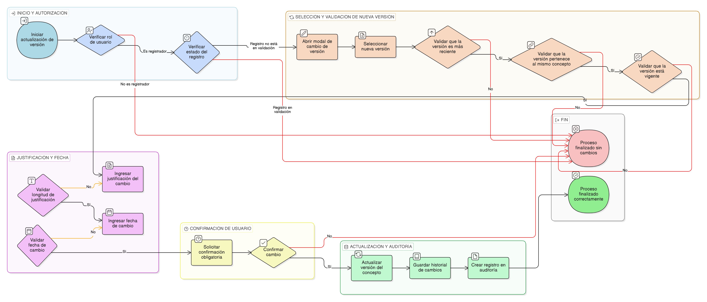

# HU-IDEAM-SNIF-REST-164

> **Identificador Historia de Usuario:** hu-ideam-snif-rest-164\
> **Nombre Historia de Usuario:** Actualizar versión de concepto en áreas restauradas

> **Sistema de información:** Sistema Nacional de Información Forestal\
> **Módulo / subsistema:** Módulo de restauración\
> **Validador temático(s):** Raymond Alexander Jiménez Arteaga

## DESCRIPCIÓN HISTORIA DE USUARIO

> **Como:** registrador.\
> **Quiero:** actualizar la versión del concepto asociado al área restaurada.\
> **Para:** alinearme con los marcos conceptuales vigentes.

## CRITERIOS DE ACEPTACIÓN

1. **Actualización de versión**\
   1.1 El sistema debe permitir la actualización de la versión del concepto asociado a un área restaurada.\
   1.2 La actualización debe realizarse mediante un modal de cambio de versión.

2. **Validaciones funcionales**\
   2.1 El sistema debe permitir únicamente el cambio a versiones más recientes del concepto.\
   2.2 La justificación del cambio debe ser obligatoria y tener un mínimo de 50 caracteres.\
   2.3 La fecha de cambio no puede ser anterior a la **fecha_registro** del proyecto.

3. **Integridad referencial**\
   3.1 El sistema debe validar que la nueva versión pertenezca al mismo concepto.\
   3.2 El sistema debe validar que la nueva versión se encuentre vigente.\
   3.3 El sistema debe guardar el historial de cambios de versión.

4. **Control por roles**\
   4.1 Solo los usuarios con rol **registrador** pueden realizar la actualización.

5. **Experiencia de usuario (UX)**\
   5.1 El sistema debe solicitar una confirmación obligatoria antes de realizar el cambio.

6. **Auditoría**\
   6.1 El sistema debe crear un registro en la tabla **auditoria_cambio_concepto** con los siguientes campos:
   - proyecto_id
   - version_anterior
   - version_nueva
   - fecha_cambio
   - justificacion

7. **Validaciones de negocio**\
   7.1 No se permite editar un registro que se encuentre en proceso de validación.

## ROLES

- **Administrador IDEAM:** No puede realizar la acción.
- **Registrador**: Puede actualizar la versión del concepto en áreas restauradas.
- **Consulta:** No puede realizar la acción.

## RESTRICCIONES Y LÍMITES

- No se permite cambiar a versiones anteriores o no vigentes.
- La actualización está bloqueada cuando el registro está en proceso de validación.

## DIAGRAMA DE FLUJO DEL PROCESO

