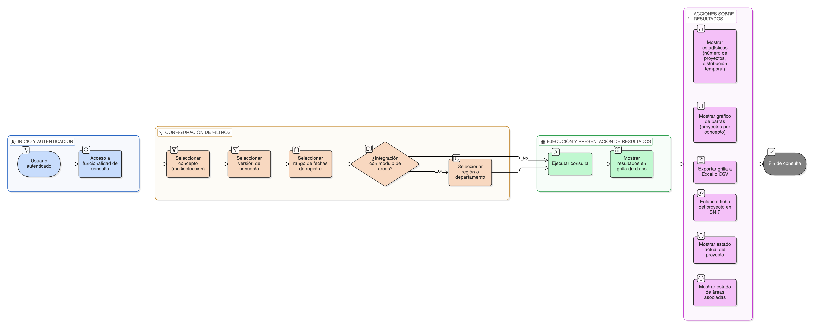

# HU-IDEAM-SNIF-REST-165

> **Identificador Historia de Usuario:** hu-ideam-snif-rest-165\
> **Nombre Historia de Usuario:** Consultar proyectos y áreas restauradas por concepto/versión

> **Sistema de información:** Sistema Nacional de Información Forestal\
> **Módulo / subsistema:** Módulo de restauración\
> **Validador temático(s):** Raymond Alexander Jiménez Arteaga

## DESCRIPCIÓN HISTORIA DE USUARIO

> **Como:** usuario de consulta.\
> **Quiero:** listar proyectos y áreas restauradas que usan una versión específica de concepto.\
> **Para:** evaluar el impacto de cambios conceptuales.

## CRITERIOS DE ACEPTACIÓN

1. **Consulta de información**\
   1.1 El sistema debe permitir la consulta de proyectos y áreas restauradas asociadas a una versión específica de concepto.\
   1.2 La consulta debe presentarse mediante un reporte con filtros múltiples.

2. **Filtros de búsqueda**\
   2.1 El sistema debe permitir filtrar por concepto, con opción de multiselección.\
   2.2 El sistema debe permitir filtrar por una versión específica del concepto.\
   2.3 El sistema debe permitir filtrar por rango de fechas de registro.\
   2.4 El sistema debe permitir filtrar por región o departamento, cuando exista integración con el módulo de áreas.

3. **Control por roles**\
   3.1 La consulta debe estar disponible para todos los usuarios autenticados y de consulta.

4. **Experiencia de usuario (UX)**\
   4.1 El sistema debe presentar los resultados en una grilla de datos.\
   4.2 La grilla debe ser exportable a formatos Excel y CSV.\
   4.3 El sistema debe mostrar estadísticas que incluyan:
   - número de proyectos por versión
   - distribución temporal  
   
   4.4 El sistema debe mostrar un gráfico de barras con proyectos por concepto.\
     4.5 El sistema debe proporcionar un enlace directo a la ficha del proyecto en el módulo SNIF.

5. **Integridad referencial**\
   5.1 El sistema debe mostrar el estado actual del proyecto.\
   5.2 El sistema debe mostrar el estado de las áreas asociadas a cada proyecto.

## ROLES

- **Usuarios autenticados**: Pueden consultar la información.
- **Usuarios de consulta**: Pueden consultar la información.

## RESTRICCIONES Y LÍMITES

- La funcionalidad corresponde únicamente a una operación de consulta (CRUD).
- Los resultados dependen de la información disponible en los proyectos y áreas restauradas.

## DIAGRAMA DE FLUJO DEL PROCESO

