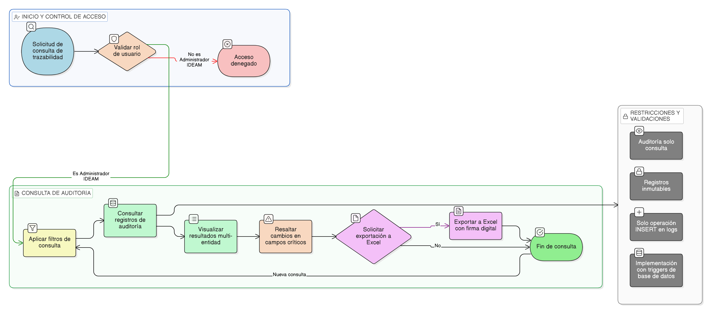

# HU-IDEAM-SNIF-REST-166

> **Identificador Historia de Usuario:** hu-ideam-snif-rest-166\
> **Nombre Historia de Usuario:** Consultar trazabilidad completa

> **Sistema de información:** Sistema Nacional de Información Forestal\
> **Módulo / subsistema:** Módulo de restauración\
> **Validador temático(s):** Raymond Alexander Jiménez Arteaga

## DESCRIPCIÓN HISTORIA DE USUARIO

> **Como:** sistema.\
> **Quiero:** ver el historial completo de cambios de cualquier entidad.\
> **Para:** garantizar transparencia y cumplimiento normativo.

## CRITERIOS DE ACEPTACIÓN

1. **Consulta de auditoría**\
   1.1 El sistema debe permitir la consulta de la trazabilidad completa de cualquier entidad.\
   1.2 La consulta debe presentarse mediante una vista de auditoría multi-entidad.

2. **Información mostrada**\
   2.1 El sistema debe mostrar la tabla o entidad modificada.\
   2.2 El sistema debe mostrar el id del registro afectado.\
   2.3 El sistema debe mostrar el usuario responsable de la acción.\
   2.4 El sistema debe mostrar la fecha y hora del cambio.\
   2.5 El sistema debe mostrar los campos modificados, indicando el valor anterior y el valor posterior.\
   2.6 El sistema debe mostrar el tipo de acción realizada (INSERT, UPDATE, DELETE).

3. **Control por roles**\
   3.1 Solo los usuarios con rol **Administrador IDEAM** pueden consultar la trazabilidad completa.

4. **Experiencia de usuario (UX)**\
   4.1 El sistema debe permitir aplicar filtros por:
   - entidad
   - usuario
   - rango de fechas
   - tipo de acción  
   
   4.2 El sistema debe permitir exportar la información a Excel con firma digital.\
     4.3 El sistema debe resaltar los cambios realizados en campos críticos, incluyendo estado y versión.

5. **Integridad referencial**\
   5.1 La trazabilidad debe implementarse mediante triggers de base de datos.

6. **Validaciones de negocio**\
   6.1 Los registros de auditoría deben ser inmutables.\
   6.2 Solo se permite la operación INSERT sobre los logs de auditoría.

## ROLES

- **Administrador IDEAM**: Puede consultar la trazabilidad completa.
- **Otros roles**: No pueden realizar esta acción.

## RESTRICCIONES Y LÍMITES

- No se permite modificar ni eliminar registros de auditoría.
- La información de auditoría es de solo consulta.

## DIAGRAMA DE FLUJO DEL PROCESO

