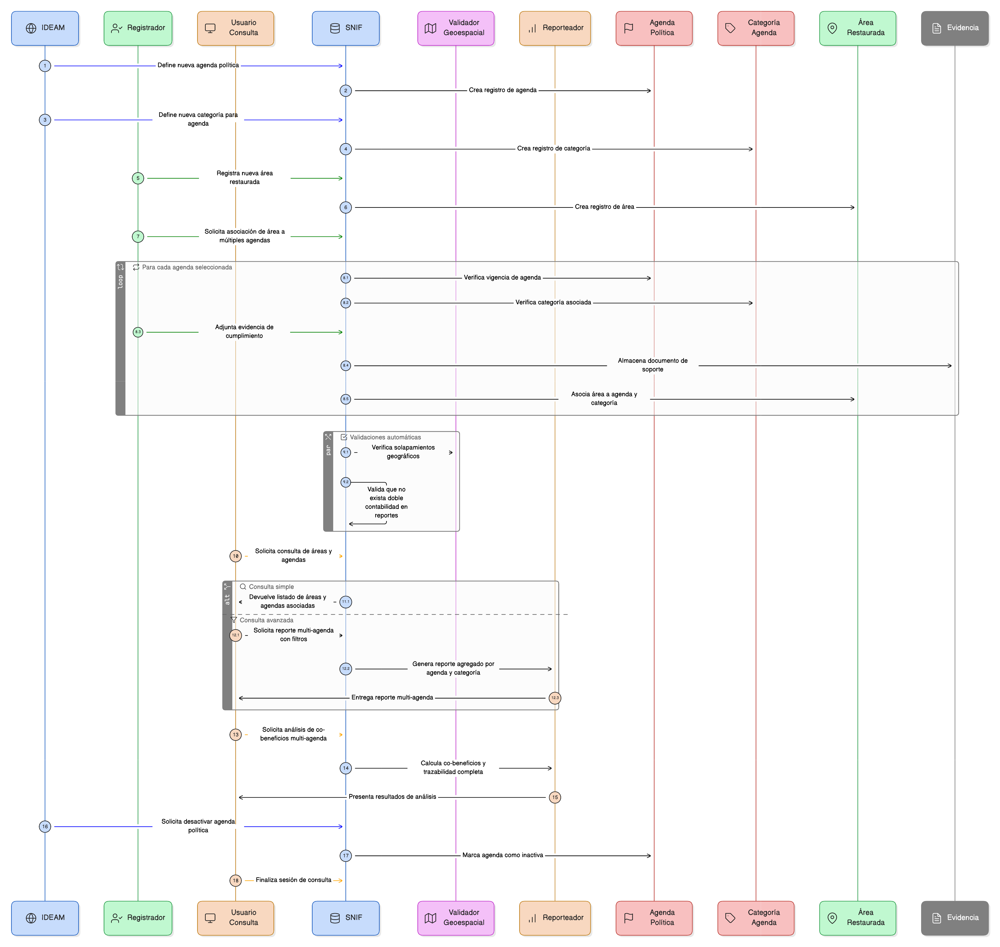

# Épica 16: Interoperabilidad Conceptual Multi-Agenda para Restauración Ecológica

## 1. Descripción general

Esta épica define la interoperabilidad conceptual del SNIF para permitir la clasificación simultánea de proyectos y áreas de restauración bajo múltiples agendas normativas internacionales mediante un modelo de multi-tagging semántico controlado.

El sistema debe garantizar:

- No duplicación de registros ni esfuerzos operativos.
- Prevención explícita de doble contabilidad en reportes oficiales.
- Trazabilidad completa entre:
  - Área → Categoría → Agenda → Marco normativo.
- Separación clara entre:
  - Definición institucional (IDEAM).
  - Aplicación operativa (Registradores).
  - Consumo analítico y de política pública (Usuario Consulta).

Esta épica habilita el cumplimiento coordinado de compromisos como CBD, NDC, UNFCCC, UNDRR, IUCN, sin fragmentar la base de datos ni replicar información.

## 2. Objetivo

Disponer de un modelo de interoperabilidad conceptual que permita:

- Clasificar proyectos y áreas de restauración bajo múltiples agendas normativas de forma simultánea.
- Evitar la doble contabilidad en reportes oficiales nacionales e internacionales.
- Garantizar la trazabilidad completa entre áreas, categorías, agendas y marcos normativos.
- Facilitar el análisis, la reportería y la toma de decisiones multi-agenda.
- Asegurar la separación entre la definición institucional de marcos normativos y su aplicación operativa.
- Proveer herramientas de validación, análisis y reportería multi-agenda con control por roles.

Con ello, el sistema fortalece la coherencia de la información, el cumplimiento de compromisos internacionales y la calidad de los reportes oficiales del SNIF.

## 3. Historias de usuario asociadas

- [**HU-IDEAM-SNIF-REST-167:** Crear agenda política](/historias_usuario/EP-IDEAM-SNIF-REST-016/HU-IDEAM-SNIF-REST-167)
- [**HU-IDEAM-SNIF-REST-168:** Desactivar agenda política](/historias_usuario/EP-IDEAM-SNIF-REST-016/HU-IDEAM-SNIF-REST-168)
- [**HU-IDEAM-SNIF-REST-169:** Consultar agendas y estadísticas](/historias_usuario/EP-IDEAM-SNIF-REST-016/HU-IDEAM-SNIF-REST-169)
- [**HU-IDEAM-SNIF-REST-170:** Crear categoría de agenda](/historias_usuario/EP-IDEAM-SNIF-REST-016/HU-IDEAM-SNIF-REST-170)
- [**HU-IDEAM-SNIF-REST-171:** Asociar áreas restauradas a múltiples agendas](/historias_usuario/EP-IDEAM-SNIF-REST-016/HU-IDEAM-SNIF-REST-171)
- [**HU-IDEAM-SNIF-REST-172:** Generar reporte multi-agenda de proyecto](/historias_usuario/EP-IDEAM-SNIF-REST-016/HU-IDEAM-SNIF-REST-172)
- [**HU-IDEAM-SNIF-REST-173:** Asociar área a agendas con evidencias](/historias_usuario/EP-IDEAM-SNIF-REST-016/HU-IDEAM-SNIF-REST-173)
- [**HU-IDEAM-SNIF-REST-174:** Validar solapamientos y doble contabilidad](/historias_usuario/EP-IDEAM-SNIF-REST-016/HU-IDEAM-SNIF-REST-174)
- [**HU-IDEAM-SNIF-REST-175:** Generar reporte agregado por agenda](/historias_usuario/EP-IDEAM-SNIF-REST-016/HU-IDEAM-SNIF-REST-175)
- [**HU-IDEAM-SNIF-REST-176:** Análisis de co-beneficios multi-agenda](/historias_usuario/EP-IDEAM-SNIF-REST-016/HU-IDEAM-SNIF-REST-176)

## 4. Riesgos

- Doble contabilidad de superficies en reportes oficiales por una mala gestión de solapamientos.
- Inconsistencias entre áreas, categorías y agendas asociadas.
- Clasificación incorrecta de proyectos bajo marcos normativos no aplicables.
- Falta de trazabilidad entre áreas, agendas y categorías.
- Uso de métricas no alineadas con definiciones oficiales de cada agenda.
- Complejidad excesiva en la gestión multi-agenda que afecte la usabilidad del sistema.
- Errores en la integración de validaciones geoespaciales de solapamiento.

## 5. Diagrama de secuencia

## 6. Wireframes / mockups
