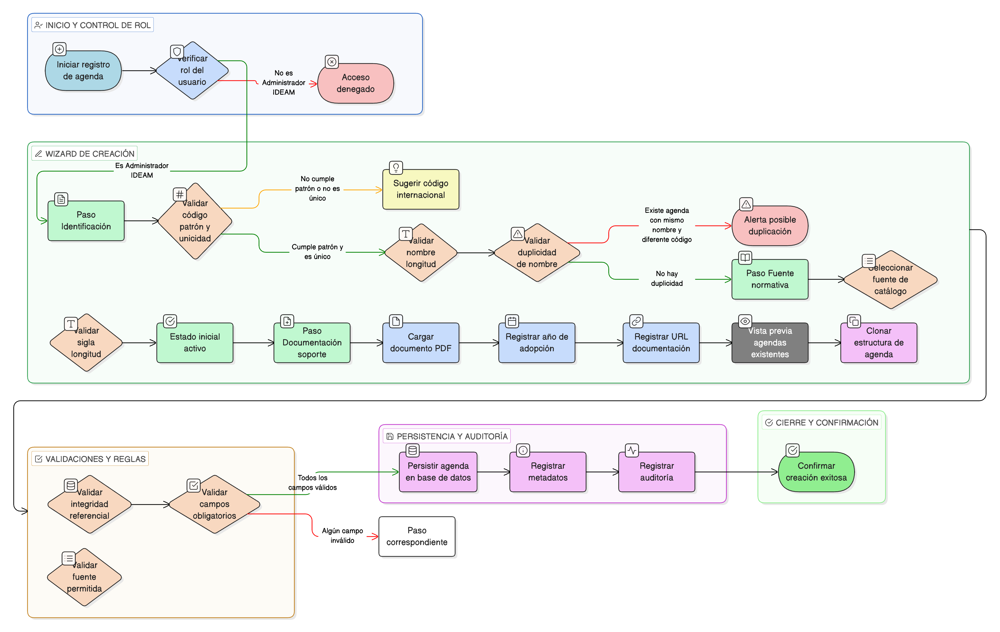

# HU-IDEAM-SNIF-REST-167

> **Identificador Historia de Usuario:** hu-ideam-snif-rest-167\
> **Nombre Historia de Usuario:** Crear Agenda Política

> **Sistema de información:** Sistema Nacional de Información Forestal\
> **Módulo / subsistema:** Módulo de restauración\
> **Validador temático(s):** Raymond Alexander Jiménez Arteaga

## DESCRIPCIÓN HISTORIA DE USUARIO

> **Como:** administrador IDEAM\
> **Quiero:** registrar una nueva agenda estratégica internacional\
> **Para:** estructurar los marcos normativos aplicables a proyectos de restauración

## CRITERIOS DE ACEPTACIÓN

1. **CRUD y formulario de creación de agenda**\
    1.1 El sistema debe disponer de un **formulario de creación de agenda** (CRUD: **Create**).\
    1.2 El formulario debe incluir los siguientes **campos obligatorios**:
    
    - **codigo**
    - **nombre**
    - **fuente**
    - **activo**
    
    1.3 El sistema debe garantizar que:
    
    - Una agenda representa un marco de reporte y clasificación, no un proyecto ni una intervención.
    - Las agendas no contienen métricas, solo reglas de clasificación.

2. **Validaciones funcionales**\
    2.1 El campo **codigo** debe cumplir el patrón **[A-Z_]{3,10}** (ej: **SBN**, **ABE**, **ECO_RRD**).\
    2.2 El campo **nombre** debe tener mínimo **10** y máximo **100** caracteres.\
    2.3 El campo **fuente** debe ser una selección de catálogo con las siguientes opciones:
    
    - **IUCN**
    - **UNFCCC**
    - **CBD**
    - **UNDRR**
    - **Nacional**
    
    2.4 El campo **sigla** debe tener máximo **20** caracteres.\
    2.5 El **estado inicial** debe ser: **activo = true**.\
    2.6 Regla de **unicidad**: el **codigo** debe ser único (**case-insensitive**).

3. **Integridad referencial y metadatos**\
    3.1 El sistema debe validar la integridad referencial: **fk_dom_estado_registro**.\
    3.2 Al crear la agenda, el sistema debe registrar metadatos:
    
    - **año adopción**
    - **URL documentación oficial**

4. **Control por roles**\
    4.1 La creación de agendas políticas debe estar disponible únicamente para el rol **Administrador IDEAM**.\
    4.2 Los roles **Registrador** y **Usuario Consulta** no deben poder crear agendas.

5. **UX esperado**\
    5.1 El sistema debe presentar un **wizard** con pasos:
    
    - (1) **Identificación**
    - (2) **Fuente normativa**
    - (3) **Documentación soporte**
    
    5.2 El sistema debe permitir la **carga de documento PDF** de la política o convenio.\
    5.3 El sistema debe ofrecer **sugerencias de códigos** según convenciones internacionales.\
    5.4 El sistema debe mostrar una **vista previa de agendas existentes** con opción de **clonar estructura**.

6. **Auditoría**\
    6.1 El sistema debe registrar en auditoría como mínimo:
    
    - **usuario_creacion**
    - **fch_creacion**
    - **documento_soporte_url**

7. **Validaciones de negocio**\
    7.1 Si ya existe una agenda con el **mismo nombre** pero **diferente código**, el sistema debe alertar **posible duplicación**.

## ROLES

- **Administrador IDEAM**: Puede crear agendas políticas.
- **Registrador**: No puede crear agendas políticas.
- **Usuario Consulta**: No puede crear agendas políticas.

## RESTRICCIONES Y LÍMITES

- Una agenda representa un marco de reporte y clasificación, no un proyecto ni una intervención.
- Las agendas no contienen métricas, solo reglas de clasificación.
- El código debe ser único (case-insensitive) y cumplir el patrón definido.
- La fuente debe seleccionarse únicamente del catálogo permitido.
- La creación está restringida únicamente al rol Administrador IDEAM.
- Debe registrarse auditoría y metadatos al momento de la creación.

## DIAGRAMA DE FLUJO DEL PROCESO

