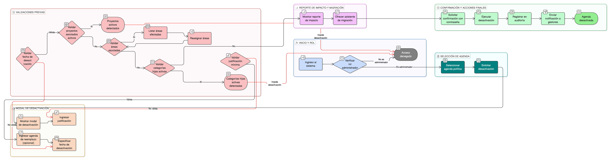

# HU-IDEAM-SNIF-REST-168

> **Identificador Historia de Usuario:** hu-ideam-snif-rest-168\
> **Nombre Historia de Usuario:** Desactivar Agenda Política

> **Sistema de información:** Sistema Nacional de Información Forestal\
> **Módulo / subsistema:** Módulo de restauración\
> **Validador temático(s):** Raymond Alexander Jiménez Arteaga

## DESCRIPCIÓN HISTORIA DE USUARIO

> **Como:** administrador IDEAM\
> **Quiero:** desactivar una agenda obsoleta\
> **Para:** reflejar cambios en marcos normativos internacionales

## CRITERIOS DE ACEPTACIÓN

1. **CRUD: Modal de desactivación con justificación**\
    1.1 El sistema debe mostrar un **modal de desactivación** para la agenda seleccionada.\
    1.2 El modal debe solicitar obligatoriamente una **justificación** de la desactivación.\
    1.3 La acción solo debe estar disponible para el rol **Administrador IDEAM**.

2. **Validaciones funcionales**\
    2.1 La **justificación** es obligatoria y debe tener **mínimo 100 caracteres**.\
    2.2 La **fecha de desactivación** no puede ser anterior a la **fecha_creación** de la agenda.\
    2.3 El sistema debe permitir **especificar una agenda de reemplazo** (si aplica).

3. **Integridad referencial**\
    3.1 Si la agenda tiene **proyectos asociados activos**, el sistema debe **impedir la desactivación**.\
    3.2 Si la agenda tiene **áreas asociadas**, el sistema debe:
    
    - Mostrar el listado de áreas afectadas.  
    - Requerir la **reasignación** antes de permitir la desactivación.  
    
    3.3 El sistema debe **validar que las categorías hijas** de la agenda estén también **desactivadas** antes de completar el proceso.

4. **Control por roles**\
    4.1 Solo el rol **Administrador IDEAM** puede desactivar agendas políticas.\
    4.2 Los roles **Registrador** y **Usuario Consulta** no pueden ejecutar esta acción.

5. **UX esperado**\
    5.1 El sistema debe mostrar un **reporte de impacto** que incluya:
    
    - Proyectos afectados.  
    - Áreas afectadas.  
    - Reportes afectados.  
    
    5.2 El sistema debe ofrecer un **asistente de migración** a la agenda de reemplazo (si aplica).\
    5.3 El sistema debe solicitar **confirmación con contraseña administrativa** antes de ejecutar la desactivación.\
    5.4 El sistema debe enviar una **notificación automática** a todos los gestores con proyectos asociados a la agenda.

6. **Auditoría**\
    6.1 El sistema debe registrar en auditoría como mínimo:
    
    - **estado_anterior**  
    - **fecha_desactivacion**  
    - **justificacion**  
    - **agenda_reemplazo_id**  

## ROLES

- **Administrador IDEAM**: Puede desactivar agendas políticas.
- **Registrador**: No puede desactivar agendas políticas.
- **Usuario Consulta**: No puede desactivar agendas políticas.

## RESTRICCIONES Y LÍMITES

- No se puede desactivar una agenda con proyectos activos asociados.
- Si existen áreas asociadas, es obligatoria la reasignación antes de desactivar.
- Las categorías hijas deben estar desactivadas previamente.
- La justificación es obligatoria y debe cumplir el mínimo de caracteres.
- La fecha de desactivación debe ser válida respecto a la fecha de creación.
- Toda desactivación debe quedar registrada en la auditoría del sistema.

## DIAGRAMA DE FLUJO DEL PROCESO

