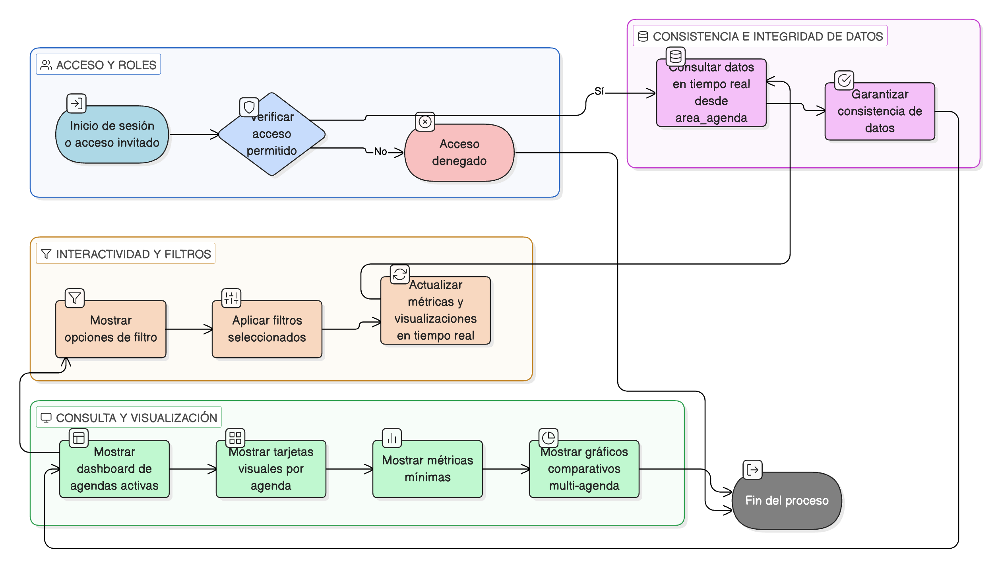

# HU-IDEAM-SNIF-REST-169

> **Identificador Historia de Usuario:** hu-ideam-snif-rest-169\
> **Nombre Historia de Usuario:** Consultar Agendas y Estadísticas

> **Sistema de información:** Sistema Nacional de Información Forestal\
> **Módulo / subsistema:** Módulo de restauración\
> **Validador temático(s):** Raymond Alexander Jiménez Arteaga

## DESCRIPCIÓN HISTORIA DE USUARIO

> **Como:** usuario de consulta analista de política\
> **Quiero:** visualizar agendas activas con métricas asociadas\
> **Para:** evaluar adopción de marcos normativos

## CRITERIOS DE ACEPTACIÓN

1. **CRUD: Dashboard interactivo de agendas**\
    1.1 El sistema debe proporcionar un **dashboard interactivo** para la consulta de agendas.\
    1.2 El dashboard debe mostrar únicamente **agendas activas**.

2. **Métricas mostradas**\
    2.1 El dashboard debe mostrar, como mínimo, las siguientes métricas:
    
    - **N° de proyectos asociados** (total y activos).  
    - **N° de áreas restauradas** bajo cada agenda.  
    - **Superficie total** (hectáreas) por agenda.  
    - **Distribución geográfica** (mapa de calor).  
    - **Tendencia temporal de adopción**.  
    - **Porcentaje de cumplimiento de metas** (si aplica).

3. **Filtros**\
    3.1 El sistema debe permitir filtrar la información por:
    
    - **Fuente normativa**.  
    - **Alcance geográfico**.  
    - **Estado**.

4. **Control por roles**\
    4.1 El acceso al dashboard debe estar disponible para **todos los usuarios autenticados e invitados**.

5. **UX esperado**\
    5.1 El sistema debe mostrar **tarjetas visuales por agenda** con indicadores clave.\
    5.2 El sistema debe incluir **gráficos comparativos multi-agenda** para facilitar el análisis.

6. **Integridad referencial**\
    6.1 Los datos mostrados en el dashboard deben provenir **en tiempo real** desde la relación **area_agenda**.\
    6.2 El sistema debe garantizar la consistencia entre:
    
    - Agendas.  
    - Proyectos asociados.  
    - Áreas restauradas.  
    - Métricas agregadas mostradas en el dashboard.

## ROLES

- **Administrador IDEAM**: Puede acceder al dashboard de agendas y estadísticas.
- **Registrador**: Puede acceder al dashboard de agendas y estadísticas.
- **Usuario Consulta**: Puede acceder al dashboard de agendas y estadísticas.
- **Usuarios invitados**: Pueden acceder al dashboard según las políticas definidas.

## RESTRICCIONES Y LÍMITES

- Solo se deben mostrar **agendas activas**.
- Las métricas deben calcularse a partir de datos en tiempo real de **area_agenda**.
- Los filtros deben afectar inmediatamente las métricas y visualizaciones.
- El dashboard es de solo consulta; no permite edición de agendas ni asociaciones.
- La información mostrada debe reflejar exactamente los datos oficiales del sistema.

## DIAGRAMA DE FLUJO DEL PROCESO

