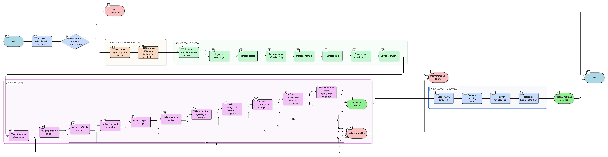

# HU-IDEAM-SNIF-REST-170

> **Identificador Historia de Usuario:** hu-ideam-snif-rest-170\
> **Nombre Historia de Usuario:** Crear Categoría de Agenda

> **Sistema de información:** Sistema Nacional de Información Forestal\
> **Módulo / subsistema:** Módulo de restauración\
> **Validador temático(s):** Raymond Alexander Jiménez Arteaga

## DESCRIPCIÓN HISTORIA DE USUARIO

> **Como:** administrador IDEAM\
> **Quiero:** definir categorías específicas dentro de una agenda\
> **Para:** clasificar proyectos según tipologías de cada marco normativo

## CRITERIOS DE ACEPTACIÓN

1. **CRUD: Formulario vinculado a agenda padre**\
    1.1 El sistema debe disponer de un formulario de creación de categoría vinculado a una agenda padre.

2. **Campos obligatorios**\
    2.1 El formulario debe incluir los siguientes campos obligatorios:
    
    - **agenda_id**
    - **codigo**
    - **nombre**
    - **sigla**
    - **activo**

3. **Validaciones funcionales**\
    3.1 **Código**: debe cumplir el patrón **[A-Z]{3,6}-[A-Z_]{3,10}** (ej: **SBN-REST**, **ABE-HID**).\
    3.2 El **prefijo del código** debe coincidir con el **código de la agenda padre**.\
    3.3 **Nombre**: mínimo **10** y máximo **100** caracteres.\
    3.4 **Sigla**: máximo **20** caracteres.\
    3.5 **Solo agendas activas** pueden tener categorías nuevas.

4. **Unicidad**\
    4.1 La combinación **(agenda_id, codigo)** debe ser única.

5. **Integridad referencial**\
    5.1 **agenda_id** debe existir y estar activa.\
    5.2 El sistema debe validar **fk_dom_estado_registro**.\
    5.3 El sistema debe crear relación con la **tabla de definiciones estándar** (si está disponible en la fuente normativa).

6. **Control por roles**\
    6.1 Esta funcionalidad debe estar disponible únicamente para el rol **Administrador IDEAM**.

7. **UX esperado**\
    7.1 El sistema debe ofrecer un **selector jerárquico**: **Agenda → Nueva categoría**.\
    7.2 El sistema debe ofrecer **autocompletado de código** basado en la agenda padre.\
    7.3 El sistema debe mostrar una **vista previa de categorías existentes** en la agenda.

8. **Auditoría**\
    8.1 El sistema debe registrar:
    
    - **usuario_creacion**
    - **fch_creacion**
    - **fuente_definicion**

## ROLES

- **Administrador IDEAM**: Puede crear categorías de agenda.
- **Registrador**: No puede crear categorías de agenda.
- **Usuario Consulta**: No puede crear categorías de agenda.

## RESTRICCIONES Y LÍMITES

- La categoría debe estar vinculada obligatoriamente a una agenda padre.
- Solo agendas activas pueden tener categorías nuevas.
- El código debe cumplir el patrón definido y su prefijo debe coincidir con el código de la agenda padre.
- La combinación (agenda_id, codigo) debe ser única.
- Debe existir integridad referencial con agenda y estado de registro.
- La creación de categorías está restringida al rol Administrador IDEAM.
- Toda creación debe quedar registrada en auditoría.

## DIAGRAMA DE FLUJO DEL PROCESO

