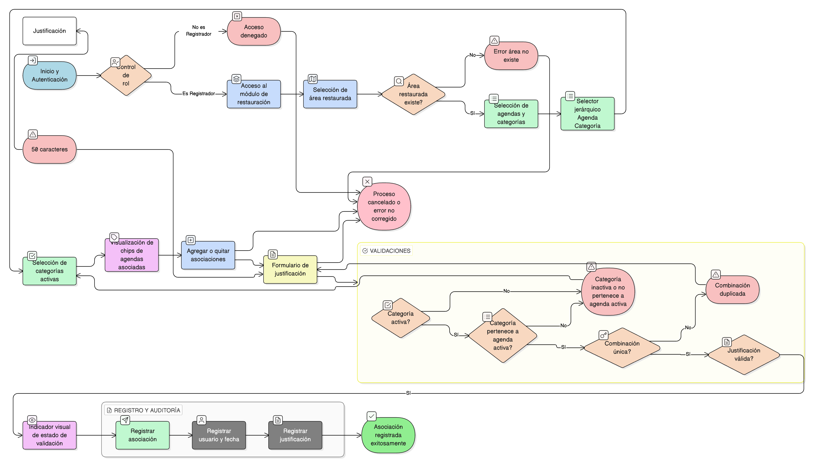

# HU-IDEAM-SNIF-REST-171

> **Identificador Historia de Usuario:** hu-ideam-snif-rest-171\
> **Nombre Historia de Usuario:** Asociar Áreas restauradas a Múltiples Agendas

> **Sistema de información:** Sistema Nacional de Información Forestal\
> **Módulo / subsistema:** Módulo de restauración\
> **Validador temático(s):** Raymond Alexander Jiménez Arteaga

## DESCRIPCIÓN HISTORIA DE USUARIO

> **Como:** REGISTRADOR\
> **Quiero:** clasificar mi proyecto bajo múltiples marcos normativos simultáneamente\
> **Para:** reportar avances bajo diferentes compromisos sin duplicar información

## CRITERIOS DE ACEPTACIÓN

1. **CRUD: Selector múltiple de agendas en formulario de áreas restauradas**\
    1.1 El sistema debe disponer de un selector múltiple de agendas en el formulario de áreas restauradas.

2. **Campos obligatorios**\
    2.1 El formulario debe incluir los siguientes campos obligatorios:
    
    - **agenda_id**
    - **categoria_id**

3. **Validaciones funcionales**\
    3.1 Un área restaurada puede asociarse a **N** agendas/categorías.\
    3.2 **Criterio**: se debe registrar una justificación de por qué el proyecto califica (mínimo **50** caracteres).\
    3.3 **Validado**: campo boolean (inicialmente **false**, requiere validación técnica).\
    3.4 Solo **categorías activas** pueden seleccionarse.

4. **Unicidad**\
    4.1 La combinación **(área_restaurada_id, categoria_id)** debe ser única.

5. **Integridad referencial**\
    5.1 **área_restaurada_id** debe existir.\
    5.2 **categoria_id** debe estar activa.\
    5.3 El sistema debe validar que la **categoría pertenece a una agenda activa**.

6. **Control por roles**\
    6.1 Esta funcionalidad debe estar disponible únicamente para el rol **Registrador**.

7. **UX esperado**\
    7.1 El sistema debe ofrecer un **selector agrupado jerárquicamente**: **Agenda → Categorías**.\
    7.2 El sistema debe mostrar **chips visuales** de agendas ya asociadas.\
    7.3 El sistema debe mostrar un **indicador visual de estado de validación** (pendiente / aprobado / rechazado).

8. **Auditoría**\
    8.1 El sistema debe registrar:
    
    - **usuario_asociacion**
    - **fecha_asociacion**
    - **criterio_justificacion**

## ROLES

- **Administrador IDEAM**: No puede realizar esta acción.
- **Registrador**: Puede asociar áreas restauradas a múltiples agendas.
- **Usuario Consulta**: No puede realizar esta acción.

## RESTRICCIONES Y LÍMITES

- Solo el rol Registrador puede realizar asociaciones de áreas restauradas a múltiples agendas.
- La justificación es obligatoria y debe tener mínimo 50 caracteres.
- Solo categorías activas pueden ser seleccionadas.
- La combinación (área_restaurada_id, categoria_id) debe ser única.
- Debe existir integridad referencial con área restaurada, categoría y agenda.
- Toda asociación debe quedar registrada en auditoría.

## DIAGRAMA DE FLUJO DEL PROCESO

