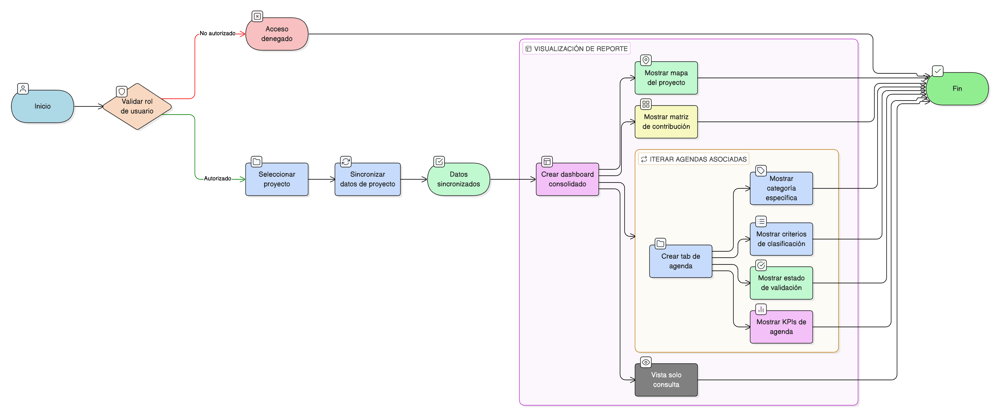

# HU-IDEAM-SNIF-REST-172

> **Identificador Historia de Usuario:** hu-ideam-snif-rest-172\
> **Nombre Historia de Usuario:** Generar Reporte Multi-Agenda de Proyecto

> **Sistema de información:** Sistema Nacional de Información Forestal\
> **Módulo / subsistema:** Módulo de restauración\
> **Validador temático(s):** Raymond Alexander Jiménez Arteaga

## DESCRIPCIÓN HISTORIA DE USUARIO

> **Como:** usuario\
> **Quiero:** visualizar mi proyecto bajo todas las agendas asociadas\
> **Para:** comprender su contribución integral a compromisos nacionales

## CRITERIOS DE ACEPTACIÓN

1. **CRUD: Vista consolidada de proyecto con tabs por agenda**\
    1.1 El sistema debe mostrar una vista consolidada del proyecto con pestañas (tabs) por cada agenda asociada.

2. **Información mostrada**\
    2.1 Por cada agenda asociada se debe mostrar un tab que incluya:
    
    - **Categoría específica**
    - **Criterios de clasificación**
    - **Estado de validación**
    
    2.2 La vista debe incluir un **mapa visual** con:
    
    - Ubicación del proyecto.
    - Capas de agendas aplicables en la zona.
    
    2.3 La vista debe incluir una **matriz de contribución** con una **tabla cruzada agendas × indicadores**.

3. **Control por roles**\
    3.1 Esta funcionalidad debe estar disponible para los siguientes roles:
    
    - **Registrador**
    - **Administrador IDEAM**
    - **Usuario Consulta**

4. **UX esperado**\
    4.1 El sistema debe presentar un **diseño tipo dashboard** con **KPIs por agenda**.

5. **Integridad referencial**\
    5.1 Los datos deben estar **sincronizados** desde:
    
    - **proyecto_agenda**
    - **area_agenda**

## ROLES

- **Administrador IDEAM**: Puede acceder a la vista de reporte multi-agenda del proyecto.
- **Registrador**: Puede acceder a la vista de reporte multi-agenda de su proyecto.
- **Usuario Consulta**: Puede acceder a la vista de reporte multi-agenda del proyecto según permisos.

## RESTRICCIONES Y LÍMITES

- La vista es de solo consulta; no permite editar asociaciones de agendas o categorías.
- La información mostrada debe provenir exclusivamente de proyecto_agenda y area_agenda.
- El acceso está controlado por roles definidos.
- El reporte debe reflejar todas las agendas asociadas al proyecto.
- La información debe mostrarse de forma consolidada y coherente.

## DIAGRAMA DE FLUJO DEL PROCESO

