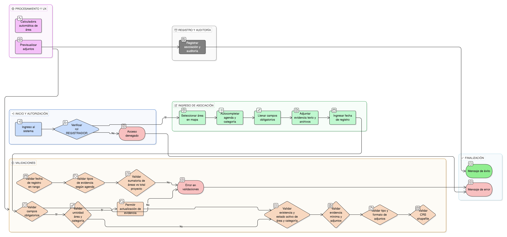

# HU-IDEAM-SNIF-REST-173

> **Identificador Historia de Usuario:** hu-ideam-snif-rest-173\
> **Nombre Historia de Usuario:** Asociar Área a Agendas con Evidencias

> **Sistema de información:** Sistema Nacional de Información Forestal\
> **Módulo / subsistema:** Módulo de restauración\
> **Validador temático(s):** Raymond Alexander Jiménez Arteaga

## DESCRIPCIÓN HISTORIA DE USUARIO

> **Como:** técnico de campo\
> **Quiero:** vincular áreas específicas a categorías de agendas con evidencias técnicas\
> **Para:** reportar superficies con precisión bajo diferentes marcos

## CRITERIOS DE ACEPTACIÓN

1. **CRUD: Formulario de asociación área-agenda con adjuntos**\
    1.1 El sistema debe disponer de un formulario de asociación área-agenda con soporte de adjuntos.

2. **Campos obligatorios**\
    2.1 El formulario debe incluir los siguientes campos obligatorios:
    
    - **area_id**
    - **agenda_id**
    - **categoria_id**
    - **evidencia**
    - **fecha_registro**

3. **Validaciones funcionales**\
    3.1 Un área puede asociarse a múltiples agendas/categorías.\
    3.2 **Evidencia**: campo texto (mínimo **100** caracteres) + adjuntos (**PDF**, **shapefile**).\
    3.3 **fecha_registro** debe estar entre **fecha_inicio** y **fecha_fin** del área (si están definidas).\
    3.4 **Tipos de evidencia según agenda**:
    
    - **SbN**: Plan de manejo aprobado  
    - **AbE**: Análisis de vulnerabilidad climática  
    - **MbE**: Línea base de carbono  
    - **Eco-RRD**: Modelación hidrológica o de amenazas  

4. **Unicidad**\
    4.1 La combinación **(area_id, categoria_id)** debe ser única, pero se debe permitir **actualización de evidencia**.

5. **Integridad referencial**\
    5.1 **area_id** debe existir y estar activa.\
    5.2 **categoria_id** debe estar activa.\
    5.3 **Validación crítica de consistencia**: la **sumatoria de áreas por agenda** debe coincidir con el **área total del proyecto** (dentro de un margen de error del **5%**).

6. **Control por roles**\
    6.1 Esta funcionalidad debe estar disponible únicamente para el rol **REGISTRADOR**.

7. **UX esperado**\
    7.1 El sistema debe ofrecer un **selector de área desde mapa interactivo**.\
    7.2 El sistema debe ofrecer **autocompletado de agendas** desde asociaciones del proyecto padre.\
    7.3 El sistema debe permitir **upload múltiple de archivos de evidencia**.\
    7.4 El sistema debe mostrar un **previsualizador de documentos adjuntos**.\
    7.5 El sistema debe incluir un **validador de formatos**: el **shapefile** debe tener **CRS consistente**.\
    7.6 El sistema debe incluir una **calculadora automática de área** desde geometría.

8. **Auditoría**\
    8.1 El sistema debe registrar:
    
    - **usuario_registro**
    - **fecha_registro**
    - **archivos_adjuntos (hash)**

## ROLES

- **Administrador IDEAM**: No puede realizar esta acción.
- **Registrador**: Puede asociar áreas a agendas con evidencias.
- **Usuario Consulta**: No puede realizar esta acción.

## RESTRICCIONES Y LÍMITES

- Solo el rol REGISTRADOR puede realizar asociaciones de áreas a agendas con evidencias.
- La evidencia textual es obligatoria y debe tener mínimo 100 caracteres.
- Se deben adjuntar archivos de evidencia en los formatos permitidos.
- La fecha_registro debe estar dentro del rango válido del área si está definido.
- La combinación (area_id, categoria_id) debe ser única, permitiendo actualización de evidencia.
- Debe cumplirse la validación crítica de consistencia del 5% respecto al área total del proyecto.
- Toda asociación debe quedar registrada en auditoría.

## DIAGRAMA DE FLUJO DEL PROCESO

