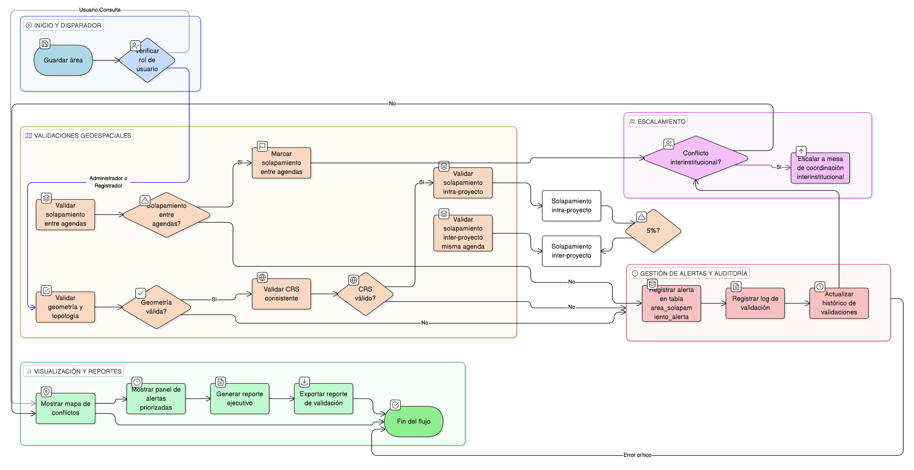

# HU-IDEAM-SNIF-REST-174

> **Identificador Historia de Usuario:** hu-ideam-snif-rest-174\
> **Nombre Historia de Usuario:** Validar Solapamientos y Doble Contabilidad

> **Sistema de información:** Sistema Nacional de Información Forestal\
> **Módulo / subsistema:** Módulo de restauración\
> **Validador temático(s):** Raymond Alexander Jiménez Arteaga

## DESCRIPCIÓN HISTORIA DE USUARIO

> **Como:** SISTEMA\
> **Quiero:** ejecutar validaciones geoespaciales de solapamiento entre áreas\
> **Para:** prevenir doble contabilidad en reportes internacionales

## CRITERIOS DE ACEPTACIÓN

1. **Validaciones geoespaciales automáticas**\
    1.1 **Solapamiento intra-proyecto**: Áreas del mismo proyecto no pueden solaparse **> 5%**.\
    1.2 **Solapamiento inter-proyecto misma agenda**: Proyectos diferentes reportando en la misma agenda/categoría, validar solapamiento **< 5%**.\
    1.3 **Solapamiento entre agendas**: Permitido (un área puede contribuir a múltiples agendas), pero se debe **marcar explícitamente** para prevenir suma duplicada.\
    1.4 **Validación de geometrías**: Topología válida, sin auto-intersecciones, **CRS consistente (MAGNA-SIRGAS origen Bogotá)**.

2. **Ejecución**\
    2.1 La validación debe ejecutarse mediante **trigger al guardar área**.

3. **Integridad referencial**\
    3.1 El sistema debe crear la tabla **area_solapamiento_alerta** con los campos:
    
    - **area1_id**
    - **area2_id**
    - **porc_solapamiento**
    - **agenda_id**
    - **estado_revision**
    
    3.2 El sistema debe **mantener histórico de validaciones** para auditoría.

4. **Control por roles**\
    4.1 Esta funcionalidad debe estar disponible para los roles **Administrador** y **Registrador**.

5. **UX esperado**\
    5.1 El sistema debe mostrar un **mapa de conflictos** para visualizar áreas con solapamiento.\
    5.2 El sistema debe mostrar un **panel de alertas priorizadas por severidad**.\
    5.3 El sistema debe generar un **reporte ejecutivo** con:
    
    - Total de **hectáreas únicas** vs **suma bruta** por agenda.
    
    5.4 El sistema debe permitir **exportar reporte de validación** para auditorías externas.

6. **Auditoría**\
    6.1 El sistema debe registrar un **log de cada validación** con:
    
    - Resultado.
    - Fecha.
    - Usuario que corrige.

## VALIDACIONES DE NEGOCIO

- Para reportes oficiales (**CBD, NDC**), usar siempre **“hectáreas únicas”** eliminando solapamientos.\
- Si existe **solapamiento entre proyectos de diferentes instituciones**, se debe **escalar a mesa de coordinación inter-institucional**.

## ROLES

- **Administrador IDEAM**: Puede ejecutar y revisar validaciones de solapamientos.
- **Registrador**: Puede ejecutar y revisar validaciones de solapamientos.
- **Usuario Consulta**: No puede ejecutar validaciones de solapamientos.

## RESTRICCIONES Y LÍMITES

- Las validaciones se ejecutan automáticamente al guardar un área.
- Los solapamientos permitidos entre agendas deben marcarse explícitamente para evitar suma duplicada.
- Las geometrías deben cumplir topología válida y CRS consistente (MAGNA-SIRGAS origen Bogotá).
- Se debe mantener histórico de validaciones para fines de auditoría.
- Para reportes oficiales siempre se deben usar hectáreas únicas.
- Los conflictos entre instituciones deben escalarse a la mesa de coordinación inter-institucional.

## DIAGRAMA DE FLUJO DEL PROCESO

