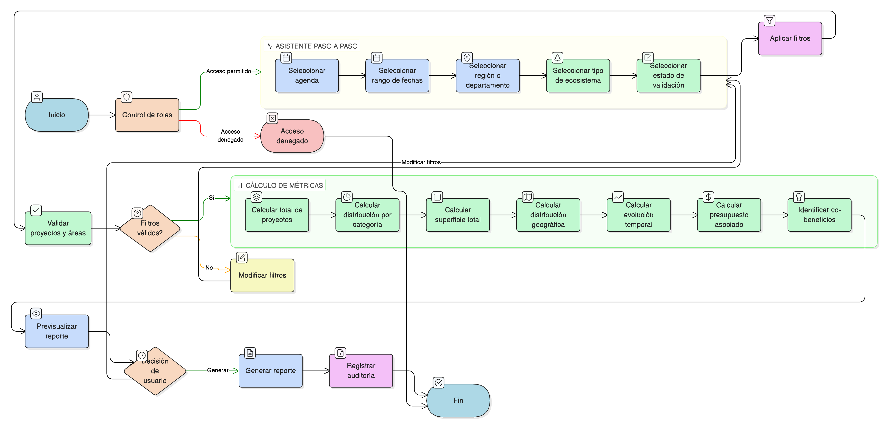

# HU-IDEAM-SNIF-REST-175

> **Identificador Historia de Usuario:** hu-ideam-snif-rest-175\
> **Nombre Historia de Usuario:** Generar Reporte Agregado por Agenda

> **Sistema de información:** Sistema Nacional de Información Forestal\
> **Módulo / subsistema:** Módulo de restauración\
> **Validador temático(s):** Raymond Alexander Jiménez Arteaga

## DESCRIPCIÓN HISTORIA DE USUARIO

> **Como:** usuario\
> **Quiero:** generar reportes oficiales por agenda estratégica\
> **Para:** cumplir compromisos de reporte internacional (CBD, UNFCCC, etc.)

## CRITERIOS DE ACEPTACIÓN

1. **CRUD: Generador de reportes con plantillas por agenda**\
    1.1 El sistema debe ofrecer un generador de reportes con plantillas por agenda.

2. **Parámetros de filtro**\
    2.1 El generador debe permitir configurar los siguientes parámetros:
    
    - **Agenda específica o multi-agenda**
    - **Rango de fechas**
    - **Región/departamento**
    - **Tipo de ecosistema**
    - **Estado de validación** (solo validados / todos)

3. **Métricas calculadas**\
    3.1 El reporte debe calcular y mostrar las siguientes métricas:
    
    - **Proyectos**: N° total, distribución por categoría  
    - **Áreas**: Superficie total (ha únicas), distribución geográfica  
    - **Evolución temporal**: Serie de tiempo de hectáreas acumuladas  
    - **Inversión**: Presupuesto asociado  
    - **Co-beneficios**: Proyectos que contribuyen a múltiples agendas  

4. **Control por roles**\
    4.1 Esta funcionalidad debe estar disponible para los roles:
    
    - **Usuario Consulta**
    - **Administrador IDEAM**
    - **Registrador**

5. **UX esperado**\
    5.1 El sistema debe ofrecer un **asistente paso a paso** según la agenda seleccionada.\
    5.2 El sistema debe permitir la **previsualización del reporte** antes de generar el archivo final.

6. **Auditoría**\
    6.1 El sistema debe registrar:
    
    - **fecha_generacion**
    - **usuario**
    - **parámetros**
    - **hash del archivo**

## VALIDACIONES DE NEGOCIO

- Validar que el reporte **solo incluya proyectos/áreas con validado = true**.

## ROLES

- **Administrador IDEAM**: Puede generar reportes agregados por agenda.
- **Registrador**: Puede generar reportes agregados por agenda.
- **Usuario Consulta**: Puede generar reportes agregados por agenda según permisos.

## RESTRICCIONES Y LÍMITES

- El reporte debe generarse a partir de plantillas por agenda.
- Los filtros deben aplicarse antes de la generación del reporte.
- Las métricas deben calcularse según los parámetros seleccionados.
- El sistema debe permitir previsualizar el reporte antes de generarlo.
- Toda generación de reporte debe quedar registrada en auditoría.
- El reporte solo debe incluir proyectos y áreas con **validado = true**.

## DIAGRAMA DE FLUJO DEL PROCESO

