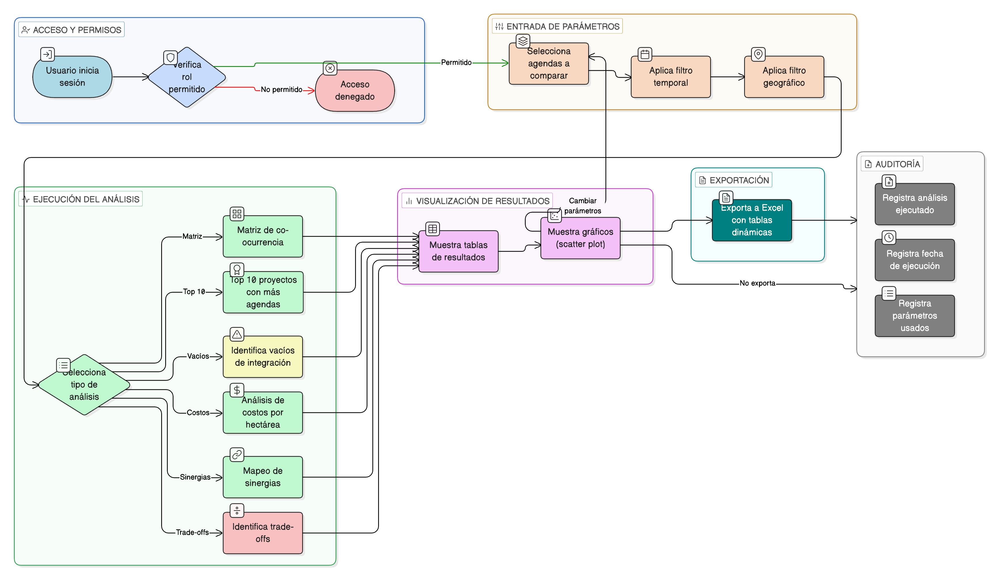

# HU-IDEAM-SNIF-REST-176

> **Identificador Historia de Usuario:** hu-ideam-snif-rest-176\
> **Nombre Historia de Usuario:** Análisis de Co-Beneficios Multi-Agenda

> **Sistema de información:** Sistema Nacional de Información Forestal\
> **Módulo / subsistema:** Módulo de restauración\
> **Validador temático(s):** Raymond Alexander Jiménez Arteaga

## DESCRIPCIÓN HISTORIA DE USUARIO

> **Como:** usuario\
> **Quiero:** identificar proyectos que contribuyen simultáneamente a múltiples agendas\
> **Para:** maximizar retorno de inversión y sinergias

## CRITERIOS DE ACEPTACIÓN

1. **CRUD: Herramienta de análisis de intersecciones**\
    1.1 El sistema debe ofrecer una herramienta de análisis de intersecciones.

2. **Análisis realizados**\
    2.1 La herramienta debe permitir realizar los siguientes análisis:
    
    - **Matriz de co-ocurrencia**: cuántos proyectos están en pares de agendas (ej: SbN + AbE).  
    - **Top 10 proyectos** con mayor N° de agendas asociadas.  
    - **Identificar "vacíos"**: agendas con poca integración.  
    - **Análisis de costos**: $ por hectárea según N° de agendas.  
    - **Mapeo de sinergias**: agendas que frecuentemente se combinan.  
    - **Identificar trade-offs**: categorías mutuamente excluyentes.  

3. **Visualizaciones**\
    3.1 El sistema debe incluir visualizaciones, por ejemplo:
    
    - **Scatter plot**: superficie vs N° de agendas.

4. **Control por roles**\
    4.1 Esta funcionalidad debe estar disponible para los roles:
    
    - **Usuario Consulta**
    - **Administrador IDEAM**
    - **Registrador**

5. **UX esperado**\
    5.1 El sistema debe ofrecer un **selector interactivo de agendas a comparar**.\
    5.2 El sistema debe ofrecer **filtros temporales y geográficos**.\
    5.3 El sistema debe permitir **exportar el análisis a Excel** con **tablas dinámicas**.

6. **Auditoría**\
    6.1 El sistema debe registrar:
    
    - **análisis ejecutado**
    - **fecha**
    - **parámetros**

## ROLES

- **Administrador IDEAM**: Puede ejecutar análisis de co-beneficios multi-agenda.
- **Registrador**: Puede ejecutar análisis de co-beneficios multi-agenda.
- **Usuario Consulta**: Puede ejecutar análisis de co-beneficios multi-agenda según permisos.

## RESTRICCIONES Y LÍMITES

- La herramienta es de análisis; no permite modificar datos de proyectos, áreas o agendas.
- Los análisis deben basarse en las asociaciones existentes entre proyectos, áreas y agendas.
- Los filtros temporales y geográficos deben aplicarse antes de ejecutar el análisis.
- El sistema debe permitir exportar resultados a Excel con tablas dinámicas.
- Toda ejecución de análisis debe quedar registrada en auditoría.

## DIAGRAMA DE FLUJO DEL PROCESO

