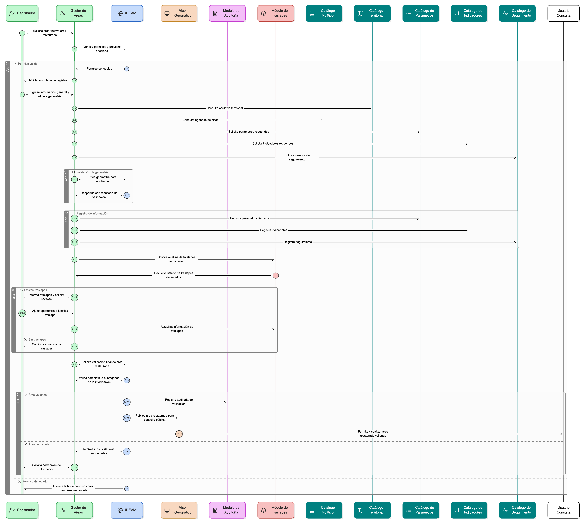

# Épica 17: Gestión Integral de Áreas Restauradas

## 1. Descripción general

Esta épica define la gestión, caracterización, validación, visualización y trazabilidad completa de las áreas restauradas asociadas a proyectos del módulo de restauración del SNIF, garantizando:

- Gobierno institucional de la información por parte del IDEAM.
- Registro técnico, social y espacial por parte de los Registradores.
- Consulta transparente y confiable desde el visor geográfico para usuarios de consulta.
- Control de calidad, auditoría y prevención de doble contabilización mediante análisis de traslapes espaciales.

La información se administra desde la aplicación de gestión y se consulta desde el visor una vez validada.

Regla general:
- Solo las áreas **VALIDADAS** son visibles en el visor para perfiles **Consulta / Invitado**.

## 2. Objetivo

Permitir la gestión integral de las áreas restauradas asociadas a proyectos, cubriendo:

- Creación y administración de áreas restauradas.
- Carga y validación de geometrías.
- Diligenciamiento de información técnica, social y administrativa.
- Asociación con agendas políticas y otros catálogos.
- Consulta del contexto territorial.
- Registro de parámetros, indicadores y seguimientos.
- Identificación, gestión y visualización de traslapes espaciales.
- Validación de completitud e integridad de la información.
- Registro de auditoría de todas las acciones.

Con ello, el sistema garantiza trazabilidad, calidad de datos y coherencia espacial y temática en la información de restauración.

## 3. Historias de usuario asociadas

- [**HU-IDEAM-SNIF-REST-177:** Ver áreas restauradas](/historias_usuario/EP-IDEAM-SNIF-REST-017/HU-IDEAM-SNIF-REST-177.md)
- [**HU-IDEAM-SNIF-REST-178:** Crear nueva área restaurada desde el proyecto](/historias_usuario/EP-IDEAM-SNIF-REST-017/HU-IDEAM-SNIF-REST-178.md)
- [**HU-IDEAM-SNIF-REST-179:** Cargar y gestionar geometría del área restaurada](/historias_usuario/EP-IDEAM-SNIF-REST-017/HU-IDEAM-SNIF-REST-179.md)
- [**HU-IDEAM-SNIF-REST-180:** Diligenciar información general del área restaurada](/historias_usuario/EP-IDEAM-SNIF-REST-017/HU-IDEAM-SNIF-REST-180.md)
- [**HU-IDEAM-SNIF-REST-181:** Gestionar agenda política del área restaurada](/historias_usuario/EP-IDEAM-SNIF-REST-017/HU-IDEAM-SNIF-REST-181.md)
- [**HU-IDEAM-SNIF-REST-182:** Consultar límite espacial del área restaurada](/historias_usuario/EP-IDEAM-SNIF-REST-017/HU-IDEAM-SNIF-REST-182.md)
- [**HU-IDEAM-SNIF-REST-183:** Gestionar parámetros del área restaurada](/historias_usuario/EP-IDEAM-SNIF-REST-017/HU-IDEAM-SNIF-REST-183.md)
- [**HU-IDEAM-SNIF-REST-184:** Gestionar indicadores del área restaurada](/historias_usuario/EP-IDEAM-SNIF-REST-017/HU-IDEAM-SNIF-REST-184.md)
- [**HU-IDEAM-SNIF-REST-185:** Registrar seguimientos del área restaurada](/historias_usuario/EP-IDEAM-SNIF-REST-017/HU-IDEAM-SNIF-REST-185.md)
- [**HU-IDEAM-SNIF-REST-186:** Gestionar catálogos asociados del área restaurada](/historias_usuario/EP-IDEAM-SNIF-REST-017/HU-IDEAM-SNIF-REST-186.md)
- [**HU-IDEAM-SNIF-REST-187:** Validar completitud e integridad del área restaurada](/historias_usuario/EP-IDEAM-SNIF-REST-017/HU-IDEAM-SNIF-REST-187.md)
- [**HU-IDEAM-SNIF-REST-188:** Registrar auditoría de cambios](/historias_usuario/EP-IDEAM-SNIF-REST-017/HU-IDEAM-SNIF-REST-188.md)
- [**HU-IDEAM-SNIF-REST-189:** Identificar traslapes espaciales del área restaurada](/historias_usuario/EP-IDEAM-SNIF-REST-017/HU-IDEAM-SNIF-REST-189.md)
- [**HU-IDEAM-SNIF-REST-190:** Visualizar listado de traslapes del área restaurada](/historias_usuario/EP-IDEAM-SNIF-REST-017/HU-IDEAM-SNIF-REST-190.md)
- [**HU-IDEAM-SNIF-REST-191:** Visualizar geometría de traslape en el visor geográfico](/historias_usuario/EP-IDEAM-SNIF-REST-017/HU-IDEAM-SNIF-REST-191.md)
- [**HU-IDEAM-SNIF-REST-192:** Asociar traslapes al área restaurada](/historias_usuario/EP-IDEAM-SNIF-REST-017/HU-IDEAM-SNIF-REST-192.md)
- [**HU-IDEAM-SNIF-REST-193:** Validar impacto de traslapes en el proceso de creación](/historias_usuario/EP-IDEAM-SNIF-REST-017/HU-IDEAM-SNIF-REST-193.md)
- [**HU-IDEAM-SNIF-REST-194:** Registrar auditoría del cálculo de traslapes](/historias_usuario/EP-IDEAM-SNIF-REST-017/HU-IDEAM-SNIF-REST-194.md)

## 4. Riesgos

- Inconsistencias entre geometría y atributos del área restaurada.
- Falta de trazabilidad de cambios en la información.
- Uso de áreas no validadas en procesos de consulta pública.
- Errores en la identificación o gestión de traslapes espaciales.
- Doble contabilización de superficies en reportes.
- Pérdida de integridad entre módulos (parámetros, indicadores, seguimiento, catálogos).
- Problemas de calidad de datos por falta de validaciones de completitud.

## 5. Diagrama de secuencia

## 6. Wireframes / mockups

