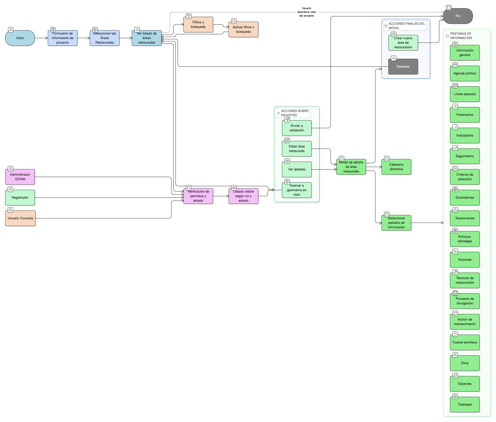

# HU-IDEAM-SNIF-REST-177

> **Identificador Historia de Usuario:** hu-ideam-snif-rest-177\
> **Nombre Historia de Usuario:** Ver áreas restauradas

> **Sistema de información:** Sistema Nacional de Información Forestal\
> **Módulo / subsistema:** Módulo de restauración\
> **Validador temático(s):** Raymond Alexander Jiménez Arteaga

## DESCRIPCIÓN HISTORIA DE USUARIO

> **Como:** usuario del sistema\
> **Quiero:** visualizar las áreas restauradas asociadas a un proyecto\
> **Para:** consultar su estado, detalle técnico y contexto espacial

## CRITERIOS DE ACEPTACIÓN

1. **Acceso desde el proyecto**\
    1.1 Desde el formulario de información del proyecto, el sistema debe permitir acceder al tab **“Áreas Restauradas”**.\
    1.2 En este tab se debe mostrar un **listado de áreas restauradas** asociadas al proyecto.

2. **Contenido del listado de áreas restauradas**\
    2.1 Cada registro del listado debe mostrar:
    
    - Icono para **acercarse a la geometría** del área en el visor geográfico.
    - **Descripción** del área restaurada.
    - **Estado del registro**.
    - **Fecha de creación**.
    - Icono de **ver**.
    - Icono de **editar**.
    - Icono de **enviar a validación**.

3. **Visibilidad por rol y estado**\
    3.1 **Cualquier perfil** puede ver esta información **una vez los registros estén validados por IDEAM**.\
    3.2 Las restricciones por rol son:
    
    - **Administrador IDEAM**: Puede ver la información de las áreas restauradas.  
    - **Registrador**: Puede ver la información de las áreas restauradas de su entidad.  
    - **Usuario Consulta**: Puede ver la información de las áreas restauradas validadas por IDEAM.  

4. **Filtros y búsqueda**\
    4.1 El listado debe permitir **filtrar por rango de fechas**.\
    4.2 El listado debe incluir un **buscador de texto**.

5. **Vista de detalle (modal) – opción Ver**\
    5.1 Al hacer clic en el icono **Ver**, el sistema debe mostrar una **ventana modal** con la información del área restaurada organizada por pestañas.\
    5.2 En la parte superior se debe mostrar de forma **dinámica**:
    
    - **Estado del registro**.
    - **Fecha de creación**.
    - **Fecha de actualización**.

6. **Pestaña: Información general**\
    6.1 Debe mostrar los siguientes campos:
    
    - Altitud mínima (msnm).  
    - Altitud máxima (msnm).  
    - Estado actual del tipo de ecosistema base.  
    - Número de personas de la comunidad participantes.  
    - Número de mujeres participantes.  
    - Edad promedio de participantes.  
    - Nivel de escolaridad promedio.  
    - Pertenece a alguna etnia.  
    - Procesos de divulgación social del proceso de restauración.  
    - Participación en capacitación de manejo de viveros y plantas útiles.  
    - Forma de participación en capacitación de manejo de viveros y plantas útiles.  
    - Participación en formulación del proyecto.  
    - Forma de participación en formulación del proyecto.  
    - Participación en establecimiento del proyecto.  
    - Forma de participación en establecimiento del proyecto.  
    - Participación en mantenimiento del proyecto.  
    - Forma de participación en mantenimiento del proyecto.  
    - Estado de propiedad del vivero.  
    - Estado de registro ICA del vivero.  
    - Número del Registro ICA.  
    - Registro de información de monitoreo al año posterior al establecimiento.  
    - Plazo establecido para la realización del monitoreo.  
    - Costo proyectado para la realización del monitoreo.  

7. **Pestaña: Agenda política**\
    7.1 Debe mostrar:
    
    - **Categorías**  
    - **Agendas**  
    - **Fecha de registro**

8. **Pestaña: Límite espacial**\
    8.1 Debe listar las capas geográficas con las cuales se intercepta el área restaurada, incluyendo al menos:
    
    - Determinantes ambientales  
    - Municipios  
    - Autoridades Ambientales  
    - AICAS  
    - Distrito de conservación de suelos (DCS)  
    - Parque Natural Regional (PNR)  
    - Reserva Natural de la sociedad civil  
    - Nodo de cambio climático  
    - Biomas  
    - Área hidrográfica  
    - Zona hidrográfica  
    - Subzona hidrográfica  

9. **Pestaña: Parámetros**\
    9.1 Debe mostrar un listado tabulado con los campos:
    
    - Año  
    - Semestre  
    - Parámetro  
    - Operador  
    - Valor 1  
    - Valor 2 (si aplica)  
    - Observación  
    - Estado del registro  
    - Fecha de creación / actualización  

10. **Pestaña: Indicadores**\
    10.1 Debe mostrar un listado tabulado con los campos:
    
    - Año  
    - Semestre  
    - Indicador  
    - Operador  
    - Valor 1  
    - Valor 2 (si aplica)  
    - Observación  
    - Estado del registro  
    - Fecha de creación / actualización  

11. **Pestaña: Seguimiento**\
    11.1 Debe mostrar un listado tabulado con los campos:
    
    - Fecha de seguimiento  
    - Logro  
    - Alcance  
    - Necesidad  
    - Área restaurada reportada (ha)  
    - Estado del registro  
    - Fecha de creación / actualización  

12. **Pestaña: Criterios de selección**\
    12.1 Debe mostrar un listado tabulado con los campos:
    
    - Criterio de selección  
    - Estado del registro  
    - Fecha de creación / actualización  

13. **Pestaña: Ecosistemas**\
    13.1 Debe mostrar un listado tabulado con los campos:
    
    - Ecosistema  
    - Estado del registro  
    - Fecha de creación / actualización  

14. **Pestaña: Tensionantes**\
    14.1 Debe mostrar un listado tabulado con los campos:
    
    - Relación tipo de tensionante – disturbio  
    - Severidad  
    - Temporalidad  
    - Estado del registro  
    - Fecha de creación / actualización  

15. **Pestaña: Enfoque-estrategia**\
    15.1 Debe mostrar un listado tabulado con los campos:
    
    - Relación enfoque – estrategia – modelo de intervención  
    - Área (Ha)  
    - Estado del registro  
    - Fecha de creación / actualización  

16. **Pestaña: Acciones**\
    16.1 Debe mostrar un listado tabulado con los campos:
    
    - Acción  
    - Estado del registro  
    - Fecha de creación / actualización  

17. **Pestaña: Técnicas de restauración**\
    17.1 Debe mostrar un listado tabulado con los campos:
    
    - Técnicas de restauración  
    - Estado del registro  
    - Fecha de creación / actualización  

18. **Pestaña: Procesos de divulgación**\
    18.1 Debe mostrar un listado tabulado con los campos:
    
    - Proceso de divulgación  
    - Estado del registro  
    - Fecha de creación / actualización  

19. **Pestaña: Acción de mantenimiento**\
    19.1 Debe mostrar un listado tabulado con los campos:
    
    - Acción de mantenimiento  
    - Descripción  
    - Estado del registro  
    - Fecha de creación / actualización  

20. **Pestaña: Fuente semillera**\
    20.1 Debe mostrar un listado tabulado con los campos:
    
    - Fuente semillera  
    - Estado del registro  
    - Fecha de creación / actualización  

21. **Pestaña: Etnia**\
    21.1 Debe mostrar un listado tabulado con los campos:
    
    - Etnia  
    - Estado del registro  
    - Fecha de creación / actualización  

22. **Pestaña: Especies**\
    22.1 Debe mostrar un listado tabulado con los campos:
    
    - Información de la especie  
    - Técnica de propagación  
    - Procedencia de la especie  
    - Nativa  
    - Área (Ha)  
    - Estado del registro  
    - Fecha de creación / actualización  

23. **Pestaña: Traslapes**\
    23.1 Debe mostrar un listado tabulado de los traslapes existentes entre el área restaurada y otras áreas, indicando:
    
    - Área traslapada  
    - Geometría asociada  
    23.2 La información debe quedar asociada a la vista del visor geográfico.

24. **Acciones al final del modal**\
    24.1 Se deben mostrar dos botones:
    
    - **Cancelar**: cierra la ventana modal.  
    - **Crear nueva área de restauración**: solo habilitado para usuarios con rol **Registrador**.

## ROLES

- **Administrador IDEAM**: Puede ver la información de las áreas restauradas.
- **Registrador**: Puede ver la información de las áreas restauradas de su entidad.
- **Usuario Consulta**: Puede ver la información de las áreas restauradas validadas por IDEAM.

## RESTRICCIONES Y LÍMITES

- Los usuarios solo pueden ver información según su rol y el estado de validación del registro.
- La creación de nuevas áreas desde este modal solo está habilitada para el rol Registrador.
- La información mostrada debe corresponder exactamente a los datos almacenados en el sistema.
- La visualización es de solo lectura para los perfiles que no tengan permisos de edición.
- El visor geográfico debe reflejar correctamente la geometría del área seleccionada.

## DIAGRAMA DE FLUJO DEL PROCESO

