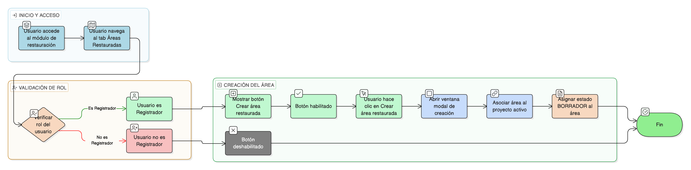

# HU-IDEAM-SNIF-REST-178

> **Identificador Historia de Usuario:** hu-ideam-snif-rest-178\
> **Nombre Historia de Usuario:** Crear nueva área restaurada desde el proyecto

> **Sistema de información:** Sistema Nacional de Información Forestal\
> **Módulo / subsistema:** Módulo de restauración\
> **Validador temático(s):** Raymond Alexander Jiménez Arteaga

## DESCRIPCIÓN HISTORIA DE USUARIO

> **Como:** usuario con perfil registrador\
> **Quiero:** crear una nueva área restaurada asociada a un proyecto\
> **Para:** iniciar su caracterización técnica y social

## CRITERIOS DE ACEPTACIÓN

1. **Acceso desde el tab Áreas Restauradas**\
    1.1 Desde el tab **Áreas Restauradas**, el sistema debe habilitar un botón **“Crear área restaurada”**.\
    1.2 El botón debe estar visible y habilitado únicamente para usuarios con rol **Registrador**.

2. **Acción de creación**\
    2.1 Al hacer clic en el botón **“Crear área restaurada”**:
    
    - Se debe abrir una **ventana modal de creación**.  
    - El área debe quedar **automáticamente asociada** al proyecto activo.  

3. **Estado inicial del área restaurada**\
    3.1 El área creada debe iniciar en estado **BORRADOR**.

## ROLES

- **Administrador IDEAM**: No puede crear áreas restauradas.
- **Registrador**: Puede crear nuevas áreas restauradas desde el proyecto.
- **Usuario Consulta**: No puede crear áreas restauradas.

## RESTRICCIONES Y LÍMITES

- La creación de áreas restauradas solo está disponible desde el tab **Áreas Restauradas** del proyecto.
- El área debe quedar automáticamente asociada al proyecto activo.
- El estado inicial del área debe ser **BORRADOR**.
- Solo el rol **Registrador** puede ejecutar esta acción.
- La acción se realiza mediante ventana modal.

## DIAGRAMA DE FLUJO DEL PROCESO

