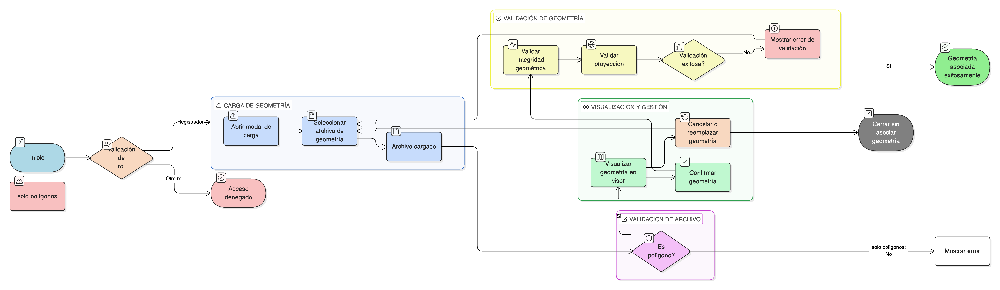

# HU-IDEAM-SNIF-REST-179

> **Identificador Historia de Usuario:** hu-ideam-snif-rest-179\
> **Nombre Historia de Usuario:** Cargar y gestionar geometría del área restaurada

> **Sistema de información:** Sistema Nacional de Información Forestal\
> **Módulo / subsistema:** Módulo de restauración\
> **Validador temático(s):** Raymond Alexander Jiménez Arteaga

## DESCRIPCIÓN HISTORIA DE USUARIO

> **Como:** usuario registrador\
> **Quiero:** cargar una geometría tipo polígono\
> **Para:** definir espacialmente el área restaurada

## CRITERIOS DE ACEPTACIÓN

1. **Alcance de la modal de creación**\
    1.1 La ventana modal de creación debe permitir:
    
    - Cargar archivos con geometría poligonal (ej. **SHP**, **GeoJSON**).  
    - Visualizar uno o varios polígonos contenidos en el archivo.  
    - Mostrar la geometría en el visor cartográfico.  

2. **Acciones del usuario**\
    2.1 El usuario debe poder:
    
    - **Confirmar** la geometría a asociar.  
    - **Cancelar** y **reemplazar** la geometría cargada.  

3. **Reglas de validación**\
    3.1 Solo se deben aceptar **geometrías tipo polígono**.\
    3.2 El sistema debe validar:
    
    - **Integridad geométrica**.  
    - **Proyección válida**.  
    
    3.3 El sistema debe mostrar **mensajes informativos** ante errores.

## ROLES

- **Administrador IDEAM**: No puede cargar ni gestionar geometría de áreas restauradas.
- **Registrador**: Puede cargar y gestionar la geometría del área restaurada.
- **Usuario Consulta**: No puede cargar ni gestionar geometría de áreas restauradas.

## RESTRICCIONES Y LÍMITES

- Solo se aceptan geometrías tipo polígono.
- El sistema debe validar integridad geométrica y proyección válida antes de permitir la confirmación.
- El usuario puede cancelar y reemplazar la geometría cargada.
- La funcionalidad solo está disponible para el rol Registrador.
- Ante errores, el sistema debe mostrar mensajes informativos claros.

## DIAGRAMA DE FLUJO DEL PROCESO

