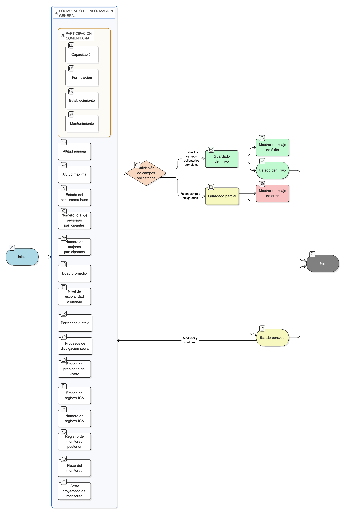

# HU-IDEAM-SNIF-REST-180

> **Identificador Historia de Usuario:** hu-ideam-snif-rest-180\
> **Nombre Historia de Usuario:** Diligenciar información general del área restaurada

> **Sistema de información:** Sistema Nacional de Información Forestal\
> **Módulo / subsistema:** Módulo de restauración\
> **Validador temático(s):** Raymond Alexander Jiménez Arteaga

## DESCRIPCIÓN HISTORIA DE USUARIO

> **Como:** usuario registrador\
> **Quiero:** diligenciar la información general del área restaurada\
> **Para:** caracterizarla social, técnica y administrativamente

## CRITERIOS DE ACEPTACIÓN

1. **Alcance del formulario**\
    1.1 El sistema debe presentar un **formulario estructurado** con los siguientes campos:
    
    - **Altitud mínima (msnm)**  
    - **Altitud máxima (msnm)**  
    - **Estado del ecosistema base**  
    - **Número total de personas participantes**  
    - **Número de mujeres participantes**  
    - **Edad promedio**  
    - **Nivel de escolaridad promedio**  
    - **Pertenece a etnia (Sí/No)**  
    - **Procesos de divulgación social**  
    - **Participación comunitaria en**:
        - Capacitación  
        - Formulación  
        - Establecimiento  
        - Mantenimiento  
    - **Estado de propiedad del vivero**  
    - **Estado de registro ICA**  
    - **Número de registro ICA**  
    - **Registro de monitoreo posterior**  
    - **Plazo del monitoreo**  
    - **Costo proyectado del monitoreo**

2. **Reglas de validación**\
    2.1 El sistema debe realizar **validación de campos obligatorios**.\
    2.2 El sistema debe mostrar **mensajes claros de error o éxito**.

3. **Guardado de información**\
    3.1 El sistema debe permitir el **guardado parcial** de la información.\
    3.2 Mientras la información no esté completa o no se envíe a validación, el área restaurada debe permanecer en **estado BORRADOR**.

## ROLES

- **Administrador IDEAM**: No puede realizar esta acción.
- **Registrador**: Puede diligenciar la información general del área restaurada.
- **Usuario Consulta**: No puede realizar esta acción.

## RESTRICCIONES Y LÍMITES

- Los campos obligatorios deben validarse antes de permitir el guardado definitivo.
- Se permite el guardado parcial en estado borrador.
- El sistema debe mostrar mensajes claros de error o éxito.
- La información debe almacenarse asociada al área restaurada correspondiente.

## DIAGRAMA DE FLUJO DEL PROCESO

