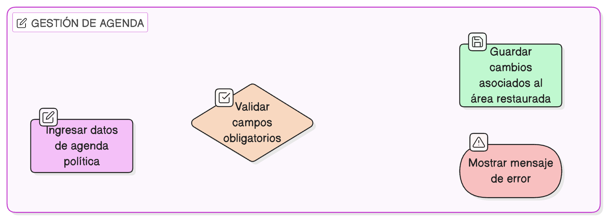

# HU-IDEAM-SNIF-REST-181

> **Identificador Historia de Usuario:** hu-ideam-snif-rest-181\
> **Nombre Historia de Usuario:** Gestionar Agenda Política del área restaurada

> **Sistema de información:** Sistema Nacional de Información Forestal\
> **Módulo / subsistema:** Módulo de restauración\
> **Validador temático(s):** Raymond Alexander Jiménez Arteaga

## DESCRIPCIÓN HISTORIA DE USUARIO

> **Como:** usuario registrador\
> **Quiero:** asociar agendas políticas al área restaurada\
> **Para:** evidenciar su alineación institucional

## CRITERIOS DE ACEPTACIÓN

1. **Acceso desde la pestaña Agenda Política**\
    1.1 El sistema debe presentar una **pestaña “Agenda Política”** dentro del detalle del área restaurada.\
    1.2 En esta pestaña se debe mostrar un **listado** con los siguientes campos:
    
    - **Categoría**
    - **Agenda**
    - **Fecha de registro**

2. **Opciones de gestión**\
    2.1 El sistema debe ofrecer las siguientes opciones:
    
    - **Crear**
    - **Editar**

3. **Validaciones**\
    3.1 El sistema debe aplicar **validaciones de obligatoriedad** en los campos requeridos al crear o editar un registro.

## ROLES

- **Administrador IDEAM**: No puede realizar esta acción.
- **Registrador**: Puede gestionar la agenda política del área restaurada.
- **Usuario Consulta**: No puede realizar esta acción.

## RESTRICCIONES Y LÍMITES

- La gestión de la agenda política se realiza exclusivamente desde la pestaña “Agenda Política”.
- El listado debe mostrar siempre categoría, agenda y fecha de registro.
- Las opciones de crear y editar deben validar campos obligatorios antes de guardar.
- Los cambios deben quedar asociados al área restaurada correspondiente.

## DIAGRAMA DE FLUJO DEL PROCESO

