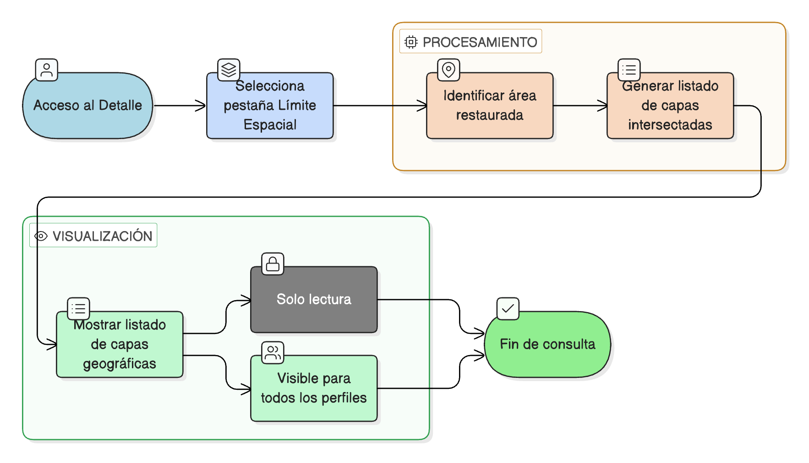

# HU-IDEAM-SNIF-REST-182

> **Identificador Historia de Usuario:** hu-ideam-snif-rest-182\
> **Nombre Historia de Usuario:** Consultar límite espacial del área restaurada

> **Sistema de información:** Sistema Nacional de Información Forestal\
> **Módulo / subsistema:** Módulo de restauración\
> **Validador temático(s):** Raymond Alexander Jiménez Arteaga

## DESCRIPCIÓN HISTORIA DE USUARIO

> **Como:** usuario\
> **Quiero:** ver las capas geográficas que interceptan el área restaurada\
> **Para:** conocer su contexto territorial

## CRITERIOS DE ACEPTACIÓN

1. **Acceso desde la pestaña Límite Espacial**\
    1.1 El sistema debe presentar una **pestaña “Límite Espacial”** dentro del detalle del área restaurada.

2. **Listado de capas geográficas**\
    2.1 El sistema debe mostrar un **listado automático de las capas geográficas intersectadas** con el área restaurada.

3. **Modo de visualización**\
    3.1 La información debe mostrarse en **modo solo lectura**.

4. **Disponibilidad**\
    4.1 La funcionalidad debe estar **visible para todos los perfiles**.

## ROLES

- **Administrador IDEAM**: Puede realizar esta acción.
- **Registrador**: Puede realizar esta acción.
- **Usuario Consulta**: Puede realizar esta acción.

## RESTRICCIONES Y LÍMITES

- La información mostrada es únicamente de consulta.
- El listado de capas debe generarse automáticamente a partir de las intersecciones espaciales.
- No se permite editar la información desde esta pestaña.
- La visualización debe reflejar el contexto territorial real del área restaurada.

## DIAGRAMA DE FLUJO DEL PROCESO

