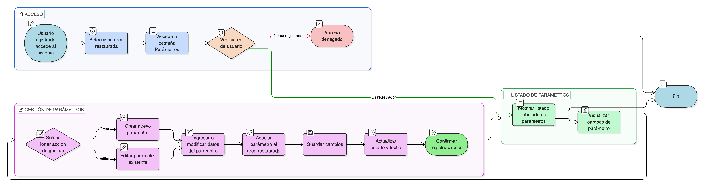

# HU-IDEAM-SNIF-REST-183

> **Identificador Historia de Usuario:** hu-ideam-snif-rest-183\
> **Nombre Historia de Usuario:** Gestionar parámetros del área restaurada

> **Sistema de información:** Sistema Nacional de Información Forestal\
> **Módulo / subsistema:** Módulo de restauración\
> **Validador temático(s):** Raymond Alexander Jiménez Arteaga

## DESCRIPCIÓN HISTORIA DE USUARIO

> **Como:** usuario registrador\
> **Quiero:** registrar parámetros medidos\
> **Para:** hacer seguimiento técnico

## CRITERIOS DE ACEPTACIÓN

1. **Acceso desde la pestaña Parámetros**\
    1.1 El sistema debe presentar una **pestaña “Parámetros”** dentro del detalle del área restaurada.

2. **Listado de parámetros**\
    2.1 El sistema debe mostrar un **listado tabulado** con los siguientes campos:
    
    - **Año**  
    - **Semestre**  
    - **Parámetro**  
    - **Operador**  
    - **Valor 1**  
    - **Valor 2 (opcional)**  
    - **Observación**  
    - **Estado**  
    - **Fecha de creación / actualización**

3. **Opciones de gestión**\
    3.1 El sistema debe permitir las opciones de:
    
    - **Crear**
    - **Editar**

## ROLES

- **Administrador IDEAM**: No puede realizar esta acción.
- **Registrador**: Puede gestionar los parámetros del área restaurada.
- **Usuario Consulta**: No puede realizar esta acción.

## RESTRICCIONES Y LÍMITES

- La gestión de parámetros se realiza exclusivamente desde la pestaña “Parámetros”.
- El listado debe mostrar todos los campos definidos.
- La creación y edición de parámetros debe quedar asociada al área restaurada correspondiente.
- Los cambios deben reflejarse en el estado y en la fecha de creación / actualización.

## DIAGRAMA DE FLUJO DEL PROCESO

