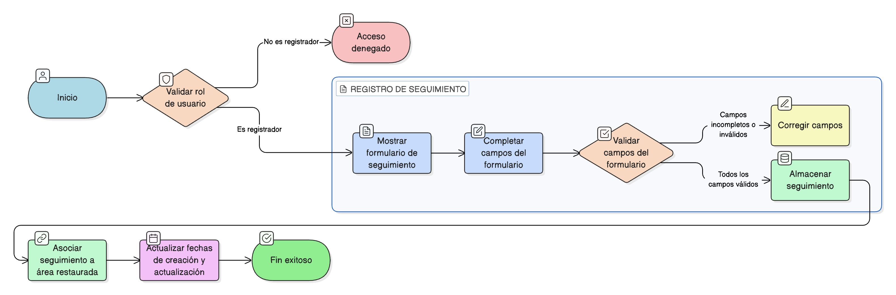

# HU-IDEAM-SNIF-REST-185

> **Identificador Historia de Usuario:** hu-ideam-snif-rest-185\
> **Nombre Historia de Usuario:** Registrar seguimientos del área restaurada

> **Sistema de información:** Sistema Nacional de Información Forestal\
> **Módulo / subsistema:** Módulo de restauración\
> **Validador temático(s):** Raymond Alexander Jiménez Arteaga

## DESCRIPCIÓN HISTORIA DE USUARIO

> **Como:** usuario registrador\
> **Quiero:** registrar seguimientos en el tiempo\
> **Para:** evidenciar avances del área restaurada

## CRITERIOS DE ACEPTACIÓN

1. **Formulario de registro de seguimiento**\
    1.1 El sistema debe permitir registrar un seguimiento del área restaurada mediante un formulario con los siguientes campos:
    
    - **Fecha de seguimiento**  
    - **Logro**  
    - **Alcance**  
    - **Necesidad**  
    - **Área restaurada reportada (ha)**  
    - **Estado**  
    - **Fecha de creación / actualización**

## ROLES

- **Administrador IDEAM**: No puede realizar esta acción.
- **Registrador**: Puede registrar seguimientos del área restaurada.
- **Usuario Consulta**: No puede realizar esta acción.

## RESTRICCIONES Y LÍMITES

- El registro de seguimientos se realiza exclusivamente para el área restaurada correspondiente.
- Los campos deben diligenciarse según el formulario definido.
- La información registrada debe reflejar el estado y las fechas de creación / actualización.
- Los seguimientos deben quedar asociados al área restaurada.

## DIAGRAMA DE FLUJO DEL PROCESO

