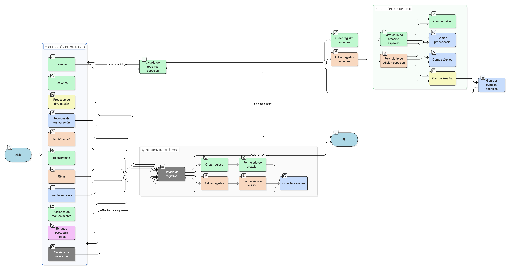

# HU-IDEAM-SNIF-REST-186

> **Identificador Historia de Usuario:** hu-ideam-snif-rest-186\
> **Nombre Historia de Usuario:** Gestionar catálogos asociados del área restaurada

> **Sistema de información:** Sistema Nacional de Información Forestal\
> **Módulo / subsistema:** Módulo de restauración\
> **Validador temático(s):** Raymond Alexander Jiménez Arteaga

## DESCRIPCIÓN HISTORIA DE USUARIO

> **Como:** usuario registrador\
> **Quiero:** gestionar los catálogos asociados del área restaurada\
> **Para:** mantener actualizada la información técnica y de contexto del área

## CRITERIOS DE ACEPTACIÓN

1. **Lógica general de gestión**\
    1.1 Cada catálogo debe seguir la misma lógica de funcionamiento:
    
    - **Listado inicial** de registros.  
    - Opción de **crear**.  
    - Opción de **editar**.  

2. **Catálogos incluidos**\
    2.1 El sistema debe permitir gestionar los siguientes catálogos asociados al área restaurada:
    
    - **Criterios de selección**  
    - **Ecosistemas**  
    - **Tensionantes**  
    - **Enfoque – estrategia – modelo**  
    - **Acciones**  
    - **Técnicas de restauración**  
    - **Procesos de divulgación**  
    - **Acciones de mantenimiento**  
    - **Fuente semillera**  
    - **Etnia**  
    - **Especies**

3. **Campos adicionales para especies**\
    3.1 En el catálogo de **Especies** se deben incluir adicionalmente los campos:
    
    - **Nativa**  
    - **Procedencia**  
    - **Técnica**  
    - **Área (ha)**

4. **Comportamiento de los listados**\
    4.1 Cada catálogo debe mostrarse en un **listado tabulado**.\
    4.2 Desde cada listado se debe poder acceder a las opciones de **crear** y **editar** registros.

## ROLES

- **Administrador IDEAM**: No puede realizar esta acción.
- **Registrador**: Puede gestionar los catálogos asociados del área restaurada.
- **Usuario Consulta**: No puede realizar esta acción.

## RESTRICCIONES Y LÍMITES

- Cada catálogo debe seguir la misma lógica de listado y gestión (crear / editar).
- La gestión se realiza siempre en el contexto de un área restaurada.
- Los cambios deben quedar asociados al área restaurada correspondiente.
- El catálogo de especies debe incluir los campos adicionales definidos.
- La información debe mantenerse consistente con los registros del área restaurada.

## DIAGRAMA DE FLUJO DEL PROCESO

