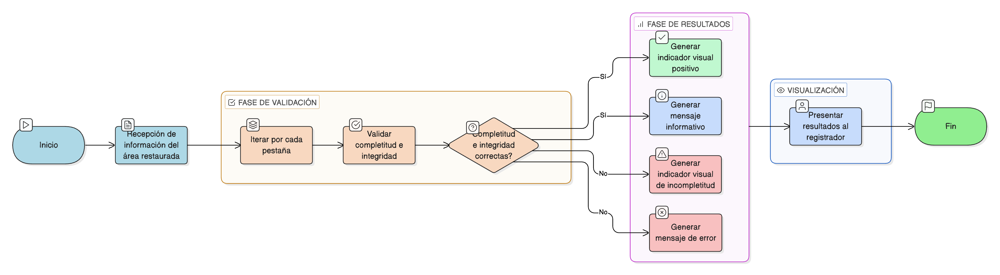

# HU-IDEAM-SNIF-REST-187

> **Identificador Historia de Usuario:** hu-ideam-snif-rest-187\
> **Nombre Historia de Usuario:** Validar completitud e integridad del área restaurada

> **Sistema de información:** Sistema Nacional de Información Forestal\
> **Módulo / subsistema:** Módulo de restauración\
> **Validador temático(s):** Raymond Alexander Jiménez Arteaga

## DESCRIPCIÓN HISTORIA DE USUARIO

> **Como:** sistema\
> **Quiero:** validar la información diligenciada\
> **Para:** asegurar calidad de los datos

## CRITERIOS DE ACEPTACIÓN

1. **Alcance de la validación**\
    1.1 El sistema debe realizar la **validación por pestaña** de la información del área restaurada.

2. **Indicadores de completitud**\
    2.1 El sistema debe mostrar **indicadores visuales de completitud** para cada pestaña.

3. **Mensajes al usuario**\
    3.1 El sistema debe mostrar **mensajes informativos y de error** según el resultado de las validaciones.

## ROLES

- **Administrador IDEAM**: No aplica acción directa (validación ejecutada por el sistema).
- **Registrador**: Visualiza los resultados de la validación del sistema.
- **Usuario Consulta**: No participa en este proceso.

## RESTRICCIONES Y LÍMITES

- La validación se ejecuta automáticamente por el sistema.
- Los indicadores visuales deben reflejar el estado real de completitud de la información.
- Los mensajes informativos y de error deben ser claros y comprensibles.
- La validación debe aplicarse sobre toda la información diligenciada del área restaurada.

## DIAGRAMA DE FLUJO DEL PROCESO

