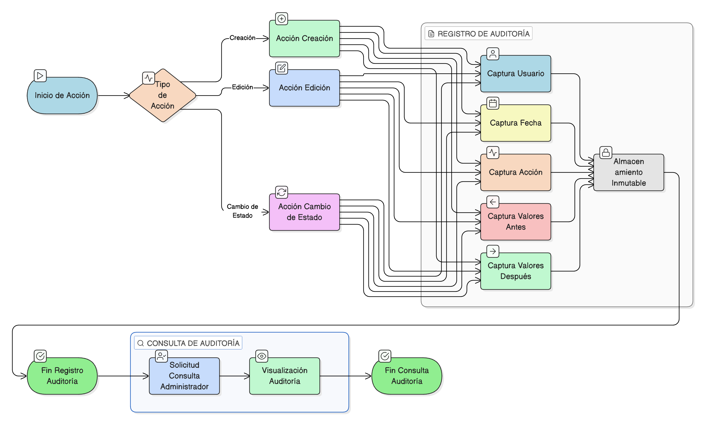

# HU-IDEAM-SNIF-REST-188

> **Identificador Historia de Usuario:** hu-ideam-snif-rest-188\
> **Nombre Historia de Usuario:** Registrar auditoría de cambios

> **Sistema de información:** Sistema Nacional de Información Forestal\
> **Módulo / subsistema:** Módulo de restauración\
> **Validador temático(s):** Raymond Alexander Jiménez Arteaga

## DESCRIPCIÓN HISTORIA DE USUARIO

> **Como:** sistema\
> **Quiero:** registrar toda acción realizada\
> **Para:** garantizar trazabilidad

## CRITERIOS DE ACEPTACIÓN

1. **Alcance del registro de auditoría**\
    1.1 El sistema debe registrar las siguientes acciones:
    
    - **Creación**  
    - **Edición**  
    - **Cambio de estado**

2. **Información almacenada en la auditoría**\
    2.1 Por cada acción registrada, el sistema debe guardar:
    
    - **Usuario**  
    - **Fecha**  
    - **Acción**  
    - **Valores antes / después**

## ROLES

- **Administrador IDEAM**: Consulta la auditoría.
- **Registrador**: Sus acciones quedan registradas en auditoría.
- **Usuario Consulta**: No tiene acceso a la auditoría.

## RESTRICCIONES Y LÍMITES

- Toda acción relevante del sistema debe generar un registro de auditoría.
- La información de auditoría debe ser inmutable.
- Los valores antes y después deben almacenarse para garantizar trazabilidad.
- La auditoría debe estar disponible para fines de control y seguimiento.

## DIAGRAMA DE FLUJO DEL PROCESO

