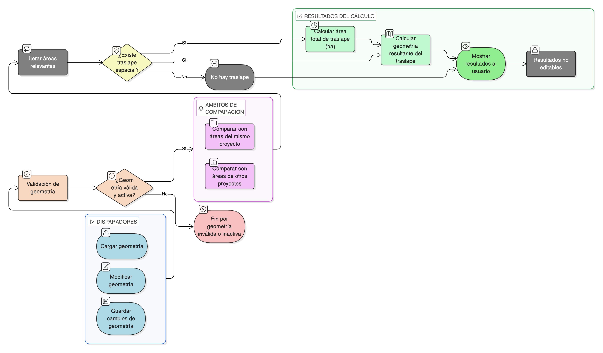

# HU-IDEAM-SNIF-REST-189

> **Identificador Historia de Usuario:** hu-ideam-snif-rest-189\
> **Nombre Historia de Usuario:** Identificar traslapes espaciales del área restaurada

> **Sistema de información:** Sistema Nacional de Información Forestal\
> **Módulo / subsistema:** Módulo de restauración\
> **Validador temático(s):** Raymond Alexander Jiménez Arteaga

## DESCRIPCIÓN HISTORIA DE USUARIO

> **Como:** sistema\
> **Quiero:** identificar automáticamente los traslapes entre el área restaurada y otras áreas restauradas registradas\
> **Para:** informar al usuario sobre posibles superposiciones espaciales

## CRITERIOS DE ACEPTACIÓN

1. **Ejecución del cálculo de traslapes**\
    1.1 El cálculo de traslapes se debe ejecutar:
    
    - Al **cargar** la geometría del área restaurada.  
    - Al **modificar** la geometría del área restaurada.  
    - Al **guardar cambios** de geometría.  

2. **Ámbito del análisis**\
    2.1 El análisis de traslapes se debe realizar contra:
    
    - **Áreas restauradas del mismo proyecto**.  
    - **Áreas restauradas de otros proyectos** (según reglas del sistema).  

3. **Geometrías consideradas**\
    3.1 El sistema debe considerar únicamente **geometrías válidas y activas**.

4. **Resultados del cálculo**\
    4.1 El sistema debe calcular:
    
    - **Área total del traslape (ha)**.  
    - **Geometría resultante del traslape**.  

5. **Comportamiento del proceso**\
    5.1 El cálculo debe ser **automático**.\
    5.2 El resultado del cálculo **no debe ser editable por el usuario**.

## ROLES

- **Sistema**: Ejecuta automáticamente la identificación y el cálculo de traslapes espaciales.

## RESTRICCIONES Y LÍMITES

- El cálculo de traslapes se ejecuta automáticamente ante cambios en la geometría.
- Solo se consideran geometrías válidas y activas.
- El usuario no puede modificar manualmente los resultados del cálculo.
- El sistema debe generar tanto el área como la geometría resultante del traslape.

## DIAGRAMA DE FLUJO DEL PROCESO

