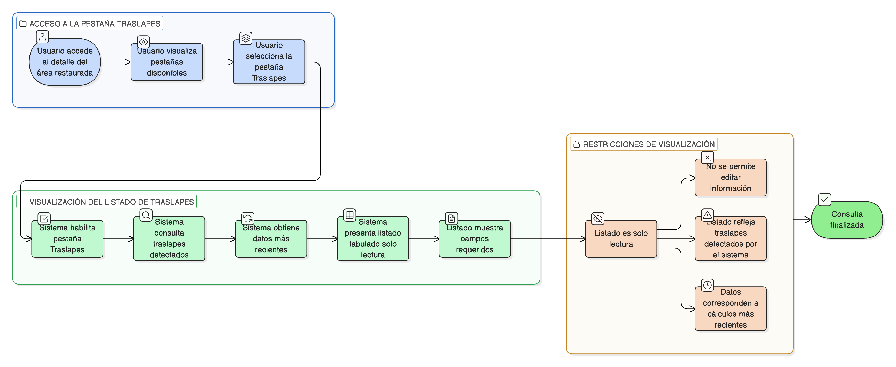

# HU-IDEAM-SNIF-REST-190

> **Identificador Historia de Usuario:** hu-ideam-snif-rest-190\
> **Nombre Historia de Usuario:** Visualizar listado de traslapes del área restaurada

> **Sistema de información:** Sistema Nacional de Información Forestal\
> **Módulo / subsistema:** Módulo de restauración\
> **Validador temático(s):** Raymond Alexander Jiménez Arteaga

## DESCRIPCIÓN HISTORIA DE USUARIO

> **Como:** usuario\
> **Quiero:** ver un listado tabulado de los traslapes detectados\
> **Para:** conocer su magnitud y relación con otras áreas restauradas

## CRITERIOS DE ACEPTACIÓN

1. **Acceso desde la pestaña Traslapes**\
    1.1 El sistema debe habilitar la **pestaña “Traslapes”** dentro del detalle del área restaurada.

2. **Listado de traslapes**\
    2.1 El sistema debe presentar un **listado tabulado** con, al menos, los siguientes campos:
    
    - **Área restaurada relacionada** (identificador / descripción)  
    - **Proyecto asociado**  
    - **Área traslapada (ha)**  
    - **Porcentaje de traslape** respecto al área restaurada actual  
    - **Estado del área restaurada relacionada**  
    - **Fecha de cálculo / actualización**

3. **Modo de visualización**\
    3.1 El listado debe mostrarse en **modo solo lectura** para todos los perfiles.

## ROLES

- **Administrador IDEAM**: Puede realizar esta acción.
- **Registrador**: Puede realizar esta acción.
- **Usuario Consulta**: Puede realizar esta acción.

## RESTRICCIONES Y LÍMITES

- La información mostrada es únicamente de consulta.
- El listado debe reflejar los traslapes detectados por el sistema.
- No se permite editar la información desde esta pestaña.
- Los datos deben corresponder a los cálculos más recientes disponibles.

## DIAGRAMA DE FLUJO DEL PROCESO

