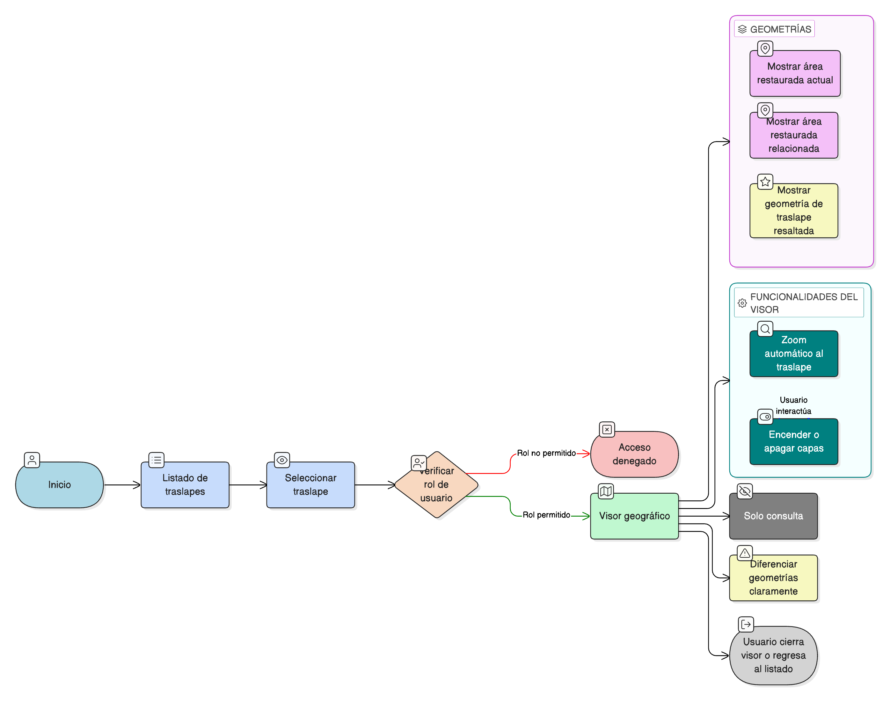

# HU-IDEAM-SNIF-REST-191

> **Identificador Historia de Usuario:** hu-ideam-snif-rest-191\
> **Nombre Historia de Usuario:** Visualizar geometría de traslape en el visor geográfico

> **Sistema de información:** Sistema Nacional de Información Forestal\
> **Módulo / subsistema:** Módulo de restauración\
> **Validador temático(s):** Raymond Alexander Jiménez Arteaga

## DESCRIPCIÓN HISTORIA DE USUARIO

> **Como:** usuario\
> **Quiero:** ver la geometría del traslape en el visor geográfico\
> **Para:** analizar espacialmente la superposición

## CRITERIOS DE ACEPTACIÓN

1. **Acceso desde el listado de traslapes**\
    1.1 Cada registro del listado de traslapes debe contar con un **ícono** para visualizar el traslape en el visor.

2. **Visualización de geometrías**\
    2.1 Al seleccionar un traslape, el sistema debe mostrar en el visor:
    
    - La **geometría del área restaurada actual**.  
    - La **geometría del área restaurada relacionada**.  
    - La **geometría resultante del traslape** resaltada.  

3. **Funcionalidades del visor**\
    3.1 El visor debe permitir:
    
    - **Zoom automático** al área de traslape.  
    - **Encendido / apagado de capas**.

## ROLES

- **Administrador IDEAM**: Puede realizar esta acción.
- **Registrador**: Puede realizar esta acción.
- **Usuario Consulta**: Puede realizar esta acción.

## RESTRICCIONES Y LÍMITES

- La visualización es únicamente de consulta.
- El visor debe mostrar claramente las tres geometrías involucradas.
- El resaltado debe diferenciar la geometría del traslape.
- Las opciones de encendido/apagado de capas deben estar disponibles durante la visualización.

## DIAGRAMA DE FLUJO DEL PROCESO

