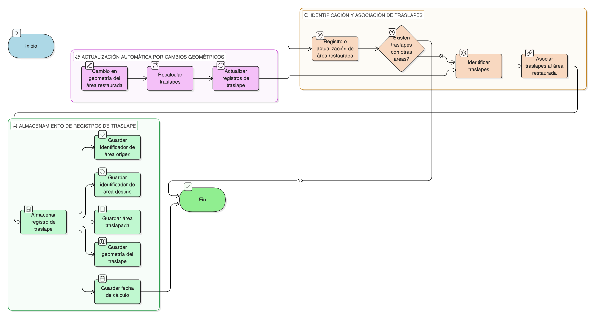

# HU-IDEAM-SNIF-REST-192

> **Identificador Historia de Usuario:** hu-ideam-snif-rest-192\
> **Nombre Historia de Usuario:** Asociar traslapes al área restaurada

> **Sistema de información:** Sistema Nacional de Información Forestal\
> **Módulo / subsistema:** Módulo de restauración\
> **Validador temático(s):** Raymond Alexander Jiménez Arteaga

## DESCRIPCIÓN HISTORIA DE USUARIO

> **Como:** sistema\
> **Quiero:** asociar los traslapes identificados al área restaurada\
> **Para:** mantener trazabilidad espacial

## CRITERIOS DE ACEPTACIÓN

1. **Almacenamiento de traslapes**\
    1.1 Los traslapes identificados deben quedar **almacenados como registros asociados** al área restaurada.

2. **Información almacenada por cada registro**\
    2.1 Cada registro de traslape debe almacenar:
    
    - **Identificador del área restaurada origen**  
    - **Identificador del área restaurada destino**  
    - **Área traslapada**  
    - **Geometría del traslape**  
    - **Fecha de cálculo**

3. **Actualización automática**\
    3.1 Los traslapes deben **actualizarse automáticamente** si cambia la geometría del área restaurada.

## ROLES

- **Sistema**: Ejecuta la asociación y actualización automática de los traslapes.

## RESTRICCIONES Y LÍMITES

- Los traslapes deben permanecer asociados al área restaurada correspondiente.
- La información de los traslapes debe actualizarse automáticamente ante cambios geométricos.
- No se permite la edición manual de los registros de traslape.
- Los registros deben conservar la fecha de cálculo correspondiente.

## DIAGRAMA DE FLUJO DEL PROCESO

